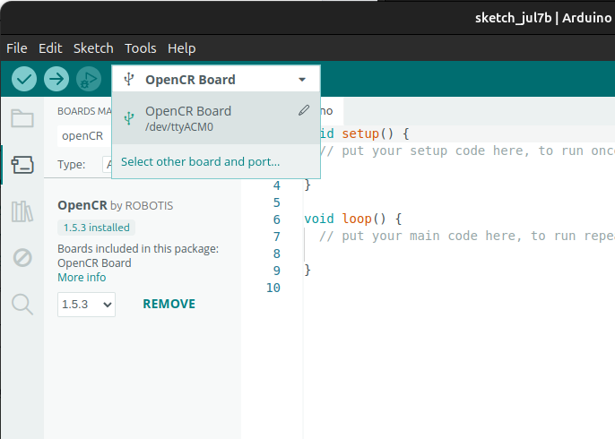
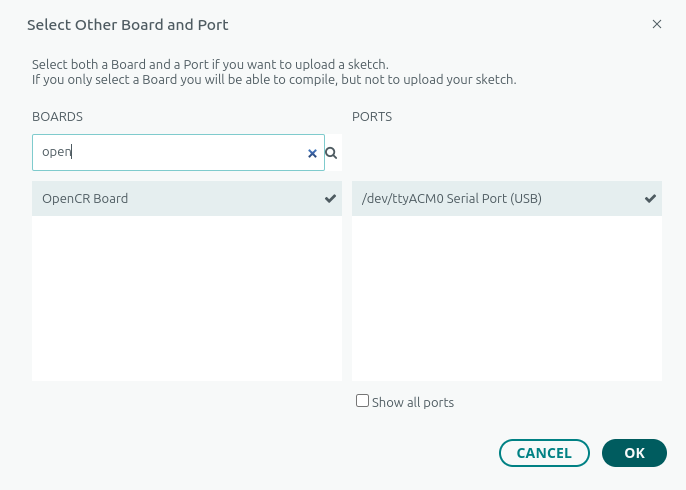
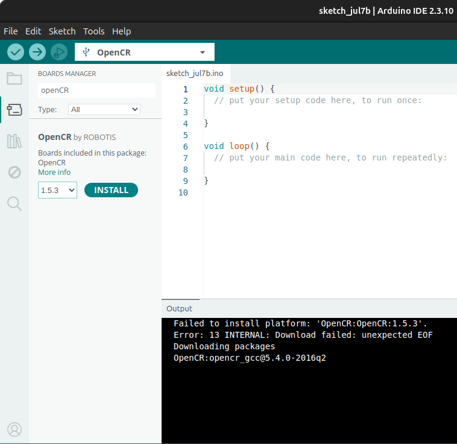
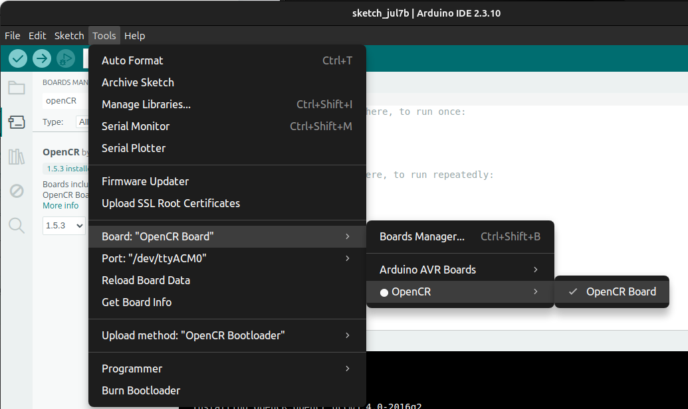
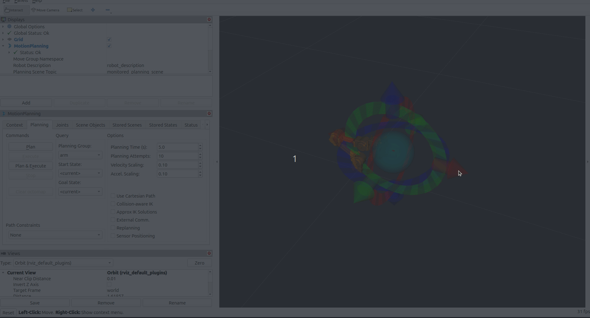

# 재현 가이드북 — OpenManipulator-X 텔레오퍼레이션 & MoveIt2 Pick-and-Place

이 문서만 보고 따라 하면 **환경 세팅부터 MoveIt2로 물체를 집어 옮기는 것까지** 재현할 수 있습니다.
에러가 나면 먼저 [troubleshooting.md](./troubleshooting.md)에서 증상을 검색해 보세요.

- **대상 하드웨어**: OpenManipulator-X (4축), OpenCR 제어보드
- **소프트웨어**: Ubuntu 24.04 LTS, ROS 2 Jazzy Jalisco, MoveIt 2
- **완료 상태**: Stage 1 (텔레오퍼레이션) ✅ · Stage 2 (MoveIt2 pick-and-place) ✅ · Stage 3 (ArUco 인식 파이프라인) ✅ · Stage 3 후속 (자동 캘리브레이션 + ArUco pick-and-place, v3) ✅

---

## 0. 완료 체크리스트

- [ ] Ubuntu 24.04 + ROS 2 Jazzy 설치
- [ ] MoveIt2 + `moveit_py` 설치
- [ ] ROBOTIS 패키지 4종 클론 & 빌드
- [ ] OpenCR에 `usb_to_dxl` 펌웨어 업로드
- [ ] 브링업 성공 (`/joint_states` 발행 확인)
- [ ] 키보드 텔레오퍼레이션 동작 확인
- [ ] RViz MoveIt 플러그인으로 Plan/Execute 성공
- [ ] `moveit_py` 스크립트로 pick-and-place 9단계 시퀀스 성공

---

## 1. 환경 세팅

### 1.1 OS & ROS 2

- Ubuntu 24.04 LTS 설치 (Rufus로 USB 부팅 디스크 생성 후 설치)
- ROS 2 Jazzy Jalisco 설치: [공식 문서](https://docs.ros.org/en/jazzy/Installation.html)

### 1.2 MoveIt2 설치

```bash
sudo apt update
sudo apt install ros-jazzy-moveit ros-jazzy-dynamixel-sdk
sudo apt install -y ros-jazzy-moveit-py
```

> ⚠️ `ros-jazzy-moveit-py`는 `ros-jazzy-moveit` 메타패키지에 포함되지 **않는 별도 apt 패키지**입니다. Stage 2 스크립트(`from moveit.planning import MoveItPy`)를 쓰려면 반드시 따로 설치해야 합니다. 설치 후 워크스페이스를 다시 source 하세요.

### 1.3 로봇팔 연결 확인

- 사용 보드: **OpenCR** (U2D2 아님)
- 라즈베리파이5에 연결된 포트 확인:
  ```bash
  ls /dev/ttyACM*
  # 예: /dev/ttyACM0
  ```
- 포트 권한 문제 시:
  ```bash
  sudo usermod -aG dialout $USER
  # 로그아웃/재로그인 또는 재부팅 필요
  ```

---

## 2. ROS 패키지 설치 (ROBOTIS 공식)

참고: [OpenManipulator-X Quick Start Guide](https://emanual.robotis.com/docs/en/platform/openmanipulator_x/quick_start_guide/#install-ros-packages)

### 2.1 저장소 클론

```bash
mkdir -p ~/ros2_ws/src
cd ~/ros2_ws/src
git clone -b jazzy https://github.com/ROBOTIS-GIT/DynamixelSDK.git && \
  git clone -b jazzy https://github.com/ROBOTIS-GIT/dynamixel_interfaces.git && \
  git clone -b jazzy https://github.com/ROBOTIS-GIT/dynamixel_hardware_interface.git && \
  git clone -b jazzy https://github.com/ROBOTIS-GIT/open_manipulator.git
```

### 2.2 의존성 설치

```bash
cd ~/ros2_ws
sudo rosdep init
rosdep update
rosdep install -i --from-path src --rosdistro $ROS_DISTRO \
  --skip-keys="librealsense2 dynamixel_hardware_interface dynamixel_interfaces dynamixel_sdk open_manipulator robotis_interfaces" \
  -y
```

### 2.3 빌드 & source

```bash
colcon build --symlink-install --cmake-args -DCMAKE_BUILD_TYPE=Release
source ~/ros2_ws/install/setup.bash
```

`~/.bashrc`에 추가해두면 편합니다:

```bash
echo "source /opt/ros/${ROS_DISTRO}/setup.bash" >> ~/.bashrc
echo "source ~/ros2_ws/install/setup.bash" >> ~/.bashrc
echo "alias cb='colcon build --symlink-install --cmake-args -DCMAKE_BUILD_TYPE=Release'" >> ~/.bashrc
source ~/.bashrc
```

### 2.4 udev 규칙 생성

```bash
ros2 run open_manipulator_bringup om_create_udev_rules
```

---

## 3. OpenCR 펌웨어 업로드 (Arduino IDE)

전원을 켜기 전에 이 단계를 마쳐야 합니다. **여기를 건너뛰면 ROS2 통신 시
`[TxRxResult] There is no status packet!` 오류가 발생합니다.**

### 3.1 32비트 컴파일러 (Ubuntu 24.04 대응)

매뉴얼의 `libncurses5-dev:i386`은 24.04(Noble)에서 제공되지 않습니다. 아래로 대체하세요.

```bash
sudo dpkg --add-architecture i386
sudo apt update
sudo apt install libc6:i386 libncurses6:i386 libstdc++6:i386
```

> 증상: 위 패키지 없이 업로드 시 `arm-none-eabi-g++: no such file or directory` (파일은 있는데 32비트 동적 링커가 없어서 발생).

### 3.2 Arduino IDE 설치 & 실행

```bash
# https://www.arduino.cc/en/software 에서 Linux 64bit용 zip 다운로드 후
cd ~/Downloads
unzip arduino-ide_2.3.10_Linux_64bit.zip -d ~/tools/
cd ~/tools/arduino-ide_2.3.10_Linux_64bit
./arduino-ide --no-sandbox    # sandbox 에러 회피 (SUID sandbox helper 에러 시 필수)
```

alias 등록:

```bash
echo "alias arduino-ide='~/tools/arduino-ide_2.3.10_Linux_64bit/arduino-ide --no-sandbox'" >> ~/.bashrc
source ~/.bashrc
```

### 3.3 OpenCR 보드 패키지 설치

1. USB 포트 권한 설정:
   ```bash
   wget https://raw.githubusercontent.com/ROBOTIS-GIT/OpenCR/master/99-opencr-cdc.rules
   sudo cp ./99-opencr-cdc.rules /etc/udev/rules.d/
   sudo udevadm control --reload-rules
   sudo udevadm trigger
   ```
2. Arduino IDE 실행 → `File → Preferences` → Additional Boards Manager URLs에 추가:
   ```
   https://raw.githubusercontent.com/ROBOTIS-GIT/OpenCR/master/arduino/opencr_release/package_opencr_index.json
   ```
3. OpenCR을 USB로 연결한 상태에서 포트 먼저 설정합니다.

   
   

4. `Tools → Board → Boards Manager`에서 `OpenCR` 검색 후 설치.

   

5. `Tools → Board`에 OpenCR Board가 뜨는지 확인 후 선택.

   

6. modemmanager 제거 (업로드 후 재연결 시 AT 명령 충돌 방지):
   ```bash
   sudo apt-get purge modemmanager
   ```

### 3.4 usb_to_dxl 펌웨어 업로드

1. `File → Examples → OpenCR → 10.Etc → usb_to_dxl` 예제 열기
2. Upload 클릭
3. 업로드 완료 로그 확인

> 업로드 실패 시 Recovery Mode: 전원 ON → `PUSH SW2` 누른 채 `Reset` 눌렀다 떼기 → `PUSH SW2` 떼기. STATUS LED가 100ms 간격으로 깜빡이면 성공.

업로드 완료 후 전원을 켜면 모든 DYNAMIXEL LED가 한 번씩 깜빡여야 정상입니다.

---

## 4. 브링업 & 텔레오퍼레이션 (Stage 1)

> **[포트 지정 필수]** `open_manipulator_x.launch.py`의 `port_name` 기본값은 U2D2용(`/dev/ttyUSB0`)입니다. OpenCR을 쓰므로 `port_name:=/dev/ttyACM0`을 반드시 명시하세요. 누락 시 `Error opening serial port!`가 반복 발생합니다.

### 4.1 브링업

```bash
ros2 launch open_manipulator_bringup open_manipulator_x.launch.py port_name:=/dev/ttyACM0
```

이 터미널을 켜둔 채로 아래 명령을 다른 터미널에서 실행합니다 (`/joint_states` 토픽이 브링업 노드에서 나오기 때문).

### 4.2 키보드 텔레오퍼레이션

```bash
ros2 run open_manipulator_teleop open_manipulator_x_teleop
```

패키지명이 버전에 따라 다를 수 있습니다. 안 되면 `ros2 pkg list | grep teleop`으로 확인하세요.

### 4.3 GUI 조작 (선택)

```bash
# 터미널 1: 브링업 (위 4.1)
# 터미널 2:
ros2 launch open_manipulator_moveit_config open_manipulator_x_moveit.launch.py
# 터미널 3:
ros2 launch open_manipulator_gui open_manipulator_x_gui.launch.py
```

### 4.4 RViz에서 목표 자세 Plan & Execute 확인

MoveIt 플러그인 인터랙티브 마커를 드래그 → Plan → Execute로 실물 팔이 움직이는지 확인합니다. `arm`/`gripper` 두 planning group이 정상 동작해야 다음 단계로 넘어갈 수 있습니다.



---

## 5. MoveIt2 Pick-and-Place (Stage 2)

**목표**: 고정된 좌표의 물체를 집어서 다른 고정된 좌표에 놓는 동작을 `moveit_py`로 스스로 경로 계획해서 수행. (카메라 인식 없음 — Stage 3 예정. 좌표는 하드코딩)

참고 매뉴얼:
- [MoveIt2 Your First Project](https://moveit.picknik.ai/main/doc/tutorials/your_first_project/your_first_project.html)
- [automaticaddison pick-and-place tutorial](https://automaticaddison.com/pick-and-place-task-using-moveit-2-and-perception-ros2-jazzy/)

### 5.1 사전 준비 (Stage 1에서 이어짐)

```bash
# 터미널 1
ros2 launch open_manipulator_bringup open_manipulator_x.launch.py port_name:=/dev/ttyACM0
# 터미널 2 (RViz 시각 확인용, 선택 - 아래 5.2 업데이트 참고. pick_and_place.py를
# 돌릴 땐 이 터미널을 끄고 브링업만 있는 상태로 실행할 것)
ros2 launch open_manipulator_moveit_config open_manipulator_x_moveit.launch.py
```

### 5.2 아키텍처 노트: `moveit_py`는 클라이언트가 아니다

`moveit_py`의 `MoveItPy` 클래스는 `MoveItCpp`를 감싼 것으로, 이미 떠 있는 `move_group` 노드에 붙는 얇은 클라이언트(RViz가 쓰는 C++ `MoveGroupInterface` 방식)가 **아닙니다.** 스크립트 프로세스 안에 독립된 두 번째 플래닝 파이프라인이 새로 뜨는 구조입니다.

**실무적 의미**: 스크립트를 돌리는 동안 RViz의 Plan/Execute를 **동시에 쓰지 마세요.** 둘 다 같은 `arm_controller`/`gripper_controller`에 goal을 보내 충돌할 수 있습니다.

> ⚠️ **업데이트 (Stage 3 후속에서 재현됨)**: "시각화 확인용으로만 RViz를 켜두는 건 괜찮다"는 위 설명은 더 이상 유효하지 않을 수 있습니다. `open_manipulator_moveit_config`의 moveit launch(=`move_group`)가 **떠 있기만 해도**, RViz로 아무것도 조작하지 않았는데 `moveit_py` 스크립트의 planning이 "Unable to sample any valid states for goal tree"로 항상 실패하는 현상이 재현됐습니다 (2단계 원본 `pick_and_place.py`로도 동일 재현 — 두 개의 planning scene 추적기가 충돌하는 것으로 추정). **`moveit_py` 스크립트를 돌릴 땐 moveit launch 자체를 켜지 말고 브링업만 켜두세요.**

### 5.3 패키지 구조

기존 ROBOTIS 벤더 패키지(`open_manipulator/`)와 분리된 독립 패키지로 생성했습니다. 업스트림 추적 코드와 과제 코드를 섞지 않기 위함이며, Stage 3(카메라 인식) 확장을 고려한 구조입니다.

```
~/ros2_ws/src/open_manipulator_x_pick_place/   (ament_python)
├── package.xml          # depend: rclpy, moveit_py, geometry_msgs
├── setup.py
├── setup.cfg
├── resource/open_manipulator_x_pick_place
└── open_manipulator_x_pick_place/
    ├── __init__.py
    └── pick_and_place.py
```

### 5.4 코드 구조 요약

- **설정 상수**: `ARM_GROUP`/`GRIPPER_GROUP`("arm"/"gripper"), SRDF named state(`home`, `open`/`close`), `GRASP_POSITION`/`PRE_GRASP_POSITION`(좌표), `PRE_PLACE_JOINT_POSITIONS`/`PLACE_JOINT_POSITIONS`(관절값 — 이유는 troubleshooting 참고), velocity/acceleration scaling 0.2 고정.
- **`build_moveit_py()`**: `MoveItConfigsBuilder`로 기존 `open_manipulator_moveit_config` 패키지의 srdf/joint_limits/controllers/kinematics를 그대로 읽어 `MoveItPy` 인스턴스 생성.
- **`plan_and_execute()`**: 모든 이동의 공통 안전 로직 — `set_start_state_to_current_state()` → `plan()` → **실패 시 로그만 남기고 즉시 반환 (execute 호출 안 함)** → 성공 시 `execute()` → 다음 planning 전 0.5초 대기.
- **이동 방식 3가지**: `move_arm_to_named_state()` (SRDF named state), `move_arm_to_pose()` (좌표, IK는 MoveIt이 계산), `move_arm_to_joint_positions()` (관절값 직접 지정, IK 계산 생략).
- **`run_pick_and_place()` 9단계**: home → pre-grasp(좌표) → grasp(좌표) → gripper close → lift(좌표) → pre-place(관절값) → place(관절값) → gripper open → retreat+home(관절값→named state).
- **`main()`**: `rclpy.init()` → `MoveItPy` 생성 → 시퀀스 실행 → 정상 종료 대신 `os._exit()`로 강제 종료 (이유는 troubleshooting #3 참고).

### 5.5 좌표/관절값 뽑는 법 — 수동교시(hand-teaching)

RViz 드래그+Plan+Execute를 반복하는 것보다 훨씬 빠르고 정확합니다.

1. **토크 끄기** (팔이 손으로 자유롭게 움직여짐):
   ```bash
   ros2 service call /dynamixel_hardware_interface/set_dxl_torque std_srvs/srv/SetBool "{data: false}"
   ```
   ⚠️ 토크가 꺼지는 순간 팔이 자중으로 축 늘어집니다 — 호출 직전에 반드시 손으로 받치세요.
2. 원하는 위치로 손으로 옮깁니다. (`/joint_states`가 실시간으로 실제 인코더 값을 반영)
3. **좌표 읽기**:
   ```bash
   ros2 run tf2_ros tf2_echo world end_effector_link
   ```
4. **관절값 읽기**:
   ```bash
   ros2 topic echo /joint_states --once
   ```
5. **측정 끝나면 토크 다시 켜기** (필수 — 안 하면 팔이 명령에 반응 안 함):
   ```bash
   ros2 service call /dynamixel_hardware_interface/set_dxl_torque std_srvs/srv/SetBool "{data: true}"
   ```

### 5.6 실행

```bash
# 브링업이 켜져 있고 토크가 켜져 있는지 확인
source ~/ros2_ws/install/setup.bash
python3 ~/ros2_ws/src/open_manipulator_x_pick_place/open_manipulator_x_pick_place/pick_and_place.py
```

RViz/move_group은 **동시에 조작하지 마세요** (Plan/Execute 겹치면 안 됨).

### 5.7 안전 설계

- velocity/acceleration scaling factor 기본 0.2로 낮게 고정
- 매 스텝 `plan()` 결과를 확인, **실패 시 execute() 호출 없이 시퀀스 즉시 중단**
- 각 waypoint 진입/완료 시 로그 출력 (`[N. 스텝이름] planning...` → `done.` 또는 `FAILED`)
- 4축 팔 IK 실패(`Unable to sample any valid states`)도 에러로 감지되어 안전하게 정지

에러가 나면 [troubleshooting.md](./troubleshooting.md)를 확인하세요.

---

## 6. 세션별 자동 캘리브레이션 + ArUco Pick-and-Place (Stage 3 후속, v3)

**목표**: 카메라(구스넥 클램프, 매 세션 재설치)와 로봇팔 사이의 좌표 변환을 하드코딩 대신 **세션 시작 시마다 자동으로 계산**하고, 그 변환으로 물체 마커 좌표를 base 좌표계로 옮겨 pick-and-place를 실행.

> 실물 하드웨어로 캘리브레이션 → ID 1 마커 물체 pick-and-place까지 end-to-end 성공 확인했습니다. 겪은 문제와 해결 과정은 [troubleshooting.md](./troubleshooting.md)의 "Stage 3 후속" 항목에 정리했습니다.

### 6.1 ArUco 마커 ID 역할 분리

| ID | 용도 |
| --- | --- |
| 0 | 캘리브레이션 전용 (그리퍼에 부착) |
| 1 | 물체 A → `MARKER_ID_TO_PLACE_JOINT_POSITIONS[1]` 위치 |
| 2~4 | 물체 B~D (현재 placeholder, 미설정) |

캘리브레이션 마커와 물체 마커는 **동일한 물리 크기**로 인쇄해야 합니다 (`aruco_parameters.yaml`의 `marker_size`가 전역 하나뿐이라 ID별 크기 보정이 없음).

그리퍼처럼 어두운/검은 표면에 붙일 마커는 `generate_aruco_marker.py --margin <px>` 옵션으로 흰색 여백(quiet zone)을 둘러서 생성해야 합니다 (기본은 `--size`의 25%). 마커 검출은 검정 테두리 바깥의 흰색과의 대비로 사각형 윤곽을 찾는 방식이라, 여백 없이 검은 배경에 바로 붙이면 배경과 마커 테두리가 합쳐져서 아예 인식이 안 됩니다.

ID 구분은 `/aruco_poses` (`PoseArray`, marker_id 없음)가 아니라 **`/aruco_markers`** (`aruco_interfaces/ArucoMarkers`: `marker_ids[]` + `poses[]`, 인덱스로 매칭)를 구독해서 처리합니다.

### 6.2 기준 좌표계: `world` (base_link 아님)

`open_manipulator_x.urdf`에는 `base_link`라는 프레임이 없고, 루트 링크 이름이 `world`입니다 (`world_fixed` 조인트로 `link1`에 고정 연결). Stage 2 `pick_and_place.py`도 이미 `BASE_FRAME = 'world'`를 사용하므로, 캘리브레이션이 계산하는 변환과 pick-and-place의 TF 조회 대상도 모두 `world`로 통일했습니다.

### 6.3 패키지 구조

새 패키지를 만들지 않고 기존 `open_manipulator_x_pick_place`에 스크립트 2개를 추가하는 방식을 택했습니다 (MoveItPy 초기화·이동 헬퍼 함수를 그대로 재사용하기 위함, Stage 2 `pick_and_place.py`는 수정하지 않음).

```
open_manipulator_x_pick_place/
├── pick_and_place.py               # Stage 2, 변경 없음 (헬퍼 함수 재사용 대상)
├── calibrate_camera_to_base.py     # 신규 — 캘리브레이션 노드
└── pick_and_place_aruco.py         # 신규 — ArUco 기반 pick-and-place
```

### 6.4 `calibrate_camera_to_base` 로직

1. 시작 전 안전 안내 배너 출력 + Enter 입력 대기.
2. `CALIBRATION_WAYPOINTS_JOINT_POSITIONS`(관절값 리스트 4개, RViz 드래그+Execute로 손교시하여 확보 — 각 자세에서 `/aruco_markers`에 ID 0이 실제로 찍히는지 확인하면서 잡음)를 순서대로 방문. 각 웨이포인트는 `move_arm_to_joint_positions()`로 이동 — planning 실패 시 그 자리에서 로그 남기고 즉시 `os._exit(1)` (다음 웨이포인트로 넘어가지 않음).
3. 웨이포인트 도착마다:
   - FK: `planning_scene_monitor.read_only().current_state.get_pose(EE_LINK)` → TCP pose (`world` 기준, position + orientation)
   - `/aruco_markers`에서 ID 0 포즈를 5프레임(기본값, `settle_frames` 파라미터) 평균
   - **마커-TCP 오프셋 보정**: ID 0 마커는 `end_effector_link` 원점이 아니라 그리퍼 표면에 붙어 있어 실측 약 8cm(손목 쪽, EE 로컬 -x 방향, `MARKER_OFFSET_IN_EE_FRAME`)만큼 떨어져 있음. 이 오프셋을 그냥 무시하면 웨이포인트마다 그리퍼가 회전할 때 오프셋도 같이 회전해서 강체 변환 가정이 깨지고 계산이 재현 가능하게(=랜덤 노이즈가 아니게) 틀어짐. TCP 위치 + `R(TCP 방향) @ MARKER_OFFSET_IN_EE_FRAME`로 "마커의 실제 world 좌표"를 역산해서 Kabsch에 넣음.
   - 위 과정 중 하나라도 실패(타임아웃)하면 캘리브레이션 중단
4. 웨이포인트 4개의 (world 좌표, camera 좌표) 쌍이 모이면 NumPy SVD 기반 Kabsch로 회전 `R`, 이동 `t` 계산 (`R,t: world ≈ R @ camera + t`), `scipy.spatial.transform.Rotation`으로 쿼터니언 변환.
5. `tf2_ros.StaticTransformBroadcaster`로 `world -> camera_frame` 정적 TF를 한 번 publish. 이후 `rclpy.spin()`으로 살아있음 유지 (터미널을 닫으면 안 됨 — TF가 늦게 붙는 구독자에게도 전달되려면 노드가 계속 떠 있어야 함).

검산 방법(재현 가능): 4개 웨이포인트의 (world, camera) 점들 사이의 pairwise 거리를 각각 구해서 비율을 비교 — 강체 변환이면 두 좌표계에서 거리가 같아야 함. 마커-TCP 오프셋 보정 전에는 비율이 1.19~1.57로 들쭉날쭉했고, 보정 후 대부분 1.0 근처로 좁혀지며 Kabsch 잔차도 1cm 이하로 줄었음.

### 6.5 `pick_and_place_aruco` 로직

- 원샷 방식: `/aruco_markers`에서 ID 1~4 중 하나라도 포함된 메시지가 오면, 그 ID(들)에 한해 5프레임 평균(캘리브레이션과 동일한 노이즈 감소 방식)을 낸 뒤 pick-and-place 1회만 실행 (지속적으로 재시도하는 루프 아님).
- 검출된 마커들을 순서대로 시도: `tf2_ros.Buffer.transform()`으로 `world` 좌표로 변환 → pre-grasp 자세 시도 → **실패하면 그 마커는 건너뛰고 다음 후보로** (IK 도달 불가 시 팔 무리하게 뻗지 않음).
  - `tf2_ros.Buffer.can_transform()`/`transform()`은 timeout 동안 그냥 busy-sleep만 하고 노드를 spin하지 않는 알려진 제약이 있어(ros2/geometry2 issue #327), TF가 아직 안 왔으면 timeout을 아무리 늘려도 영원히 못 받음. `can_transform()`이 참이 될 때까지 직접 `rclpy.spin_once()`를 돌려준 뒤에 `transform()`을 호출하도록 처리.
- **pre-grasp/grasp는 좌표(pose) 목표가 아니라 관절값(joint-space) 목표로 실행** (`move_arm_to_pose_seeded()`): `arm`은 position-only IK라 여유자유도가 1개 있는데, OMPL이 pose 목표에 대해 자체적으로 고르는 IK 시드가 자꾸 자기충돌하는 해로 수렴해서 Stage2 검증 좌표와 1cm 이내로 가까운 목표조차 계속 실패했음 (Stage 2가 pre-place/place에서 이미 겪은 것과 동일 증상 — 그쪽은 손교시 관절값으로 우회). 카메라로 실시간으로 받는 좌표는 미리 손교시할 수 없으므로, **`RobotState.set_from_ik()`를 home 자세(전부 0) 시드로 직접 호출**해서 관절값을 구한 뒤 그 값으로 `move_arm_to_joint_positions()` 실행 — OMPL의 자체 IK 샘플링을 우회.
- pre-grasp planning이 성공해 실제로 하강을 시작한 이후 단계가 실패하면 (물체를 이미 집었을 수 있으므로) 다음 마커로 넘어가지 않고 **그 자리에서 전체 시퀀스 중단** — Stage 2와 동일한 안전 원칙.
- `MARKER_ID_TO_PLACE_JOINT_POSITIONS` 딕셔너리로 ID→목적지 관절값 매핑 (ID 1은 Stage 2 값 재사용, 2~4는 손교시 필요·현재 미설정).
- **`GRASP_X_OFFSET`/`GRASP_Y_OFFSET`/`GRASP_Z_OFFSET`**: depth 카메라 없이 단안(monocular) ArUco `solvePnP`로만 위치를 추정하다 보니, 마커 자체 위치와 실제로 그리퍼가 닫혀야 할 지점 사이에 물체/부착 위치에 따른 오차가 생김. 실물 테스트로 실측한 보정값(X: -0.03, Y: -0.03, Z: -0.02)을 넣어둠 — 물체나 마커 부착 위치가 바뀌면 다시 튜닝 필요.

**아키텍처 노트**: `moveit_py` 스크립트(캘리브레이션, pick-and-place)를 돌릴 때 `open_manipulator_moveit_config`의 moveit launch(`move_group`)를 **동시에 켜두면 안 됩니다.** 둘 다 독립된 planning scene 추적기를 가지고 있어서 충돌하면 어떤 목표를 잡든 IK가 항상 실패합니다 (6.6절 터미널 구성 참고).

### 6.6 실행 순서 (매 테스트 세션마다)

```bash
# 터미널 1: 카메라
# pixel_format 없이 켜면 usb_cam이 "terminate called after throwing an
# instance of 'char*'"로 죽음. image_width/height는 ~/.ros/camera_info/
# default_cam.yaml 캘리브레이션이 1280x720 기준이라 반드시 맞춰야 함
# (안 맞추면 해상도 불일치로 ArUco pose의 z값이 틀어짐). 이 해상도에서
# C920은 30fps가 아니라 실측 약 9~10Hz로 나옴 - 정지 상태 마커 인식 용도로는 충분.
ros2 run usb_cam usb_cam_node_exe --ros-args \
  -p video_device:=/dev/video2 \
  -p pixel_format:=yuyv \
  -p image_width:=1280 \
  -p image_height:=720

# 터미널 2: ArUco 인식
# aruco_pose_estimation.launch.py는 realsense2_camera 패키지를 강제로
# include하려고 시도해서, 이 패키지가 없으면(RealSense 대신 일반 USB
# 웹캠을 쓰는 이 프로젝트에서는 없음) launch 자체가 예외로 죽고 안에서
# 막 뜬 aruco_node.py까지 같이 종료된다. launch 파일 대신 노드를 직접 실행.
# camera_info_topic 기본값도 RealSense용 이름(/camera/color/camera_info)이라
# usb_cam이 실제로 쓰는 /camera_info로 override 필요.
# marker_size는 실제로 인쇄한 마커의 물리 크기(m)로 반드시 맞춰야 z값이
# 정확히 나온다 (기본값 0.2m는 이 프로젝트의 실제 마커 크기와 다름 - 잘못
# 넣으면 solvePnP가 거리를 실제보다 훨씬 멀게/가깝게 계산해서 IK가 안
# 닿는 걸로 나옴). 이 프로젝트의 실측 마커 크기: 58mm = 0.058m.
ros2 run aruco_pose_estimation aruco_node.py --ros-args \
  -p image_topic:=/image_raw \
  -p camera_info_topic:=/camera_info \
  -p camera_frame:=camera_link \
  -p marker_size:=0.058 \
  -p use_depth_input:=false \
  -p aruco_dictionary_id:=DICT_5X5_250

# 터미널 3: 브링업만 (MoveIt launch는 켜지 말 것!)
# moveit_py 스크립트(캘리브레이션, pick-and-place)는 move_group에 붙는
# 클라이언트가 아니라 자기 안에 독립된 두 번째 planning 파이프라인을
# 내장한다 (5.2절). open_manipulator_moveit_config의 moveit launch로
# move_group을 따로 띄운 채 moveit_py 스크립트를 실행하면 두 planning
# scene 추적기가 충돌해서 "Unable to sample any valid states for goal
# tree"가 어떤 목표를 잡든 항상 뜬다 (Stage 2 원본 스크립트로도 재현됨).
# RViz 시각 확인이 필요하면 스크립트를 끈 뒤 별도로 켤 것.
ros2 launch open_manipulator_bringup open_manipulator_x.launch.py port_name:=/dev/ttyACM0

# 터미널 4: 캘리브레이션 (완료 후에도 TF를 계속 유지하기 위해 살아있음 — 닫지 말 것)
ros2 run open_manipulator_x_pick_place calibrate_camera_to_base

# 터미널 5: ArUco pick-and-place (터미널 4의 캘리브레이션이 끝난 뒤 실행)
ros2 run open_manipulator_x_pick_place pick_and_place_aruco
```

### 6.7 안전 설계

- 모든 실물 이동은 Stage 2와 동일하게 velocity/acceleration scaling 0.2로 고정 (`pick_and_place.py`의 상수 재사용).
- 매 웨이포인트/스텝마다 `plan()` 성공 여부를 확인한 뒤에만 `execute()` — 실패 시 그 자리에서 로그 남기고 중단.
- 캘리브레이션 시작 전 터미널에 안전 안내 배너 출력 + Enter 입력으로 사람이 직접 확인 후 진행.
- ArUco pick-and-place는 IK 도달 불가 물체는 건너뛰되, 그리퍼가 이미 닫힌 이후의 실패는 다음 물체로 넘어가지 않고 즉시 중단.

### 6.8 완료 체크리스트

- [x] 캘리브레이션 웨이포인트 4개 손교시로 채우기
- [x] ID 0 마커(그리퍼용) 생성·부착, ID 1과 동일 크기로 인쇄 (여백 포함 — `generate_aruco_marker.py --margin` 참고)
- [x] 캘리브레이션 4개 웨이포인트가 안전하게(느린 속도, planning 실패 시 중단) 순회됨
- [x] 계산된 TF로 물체 마커(ID 1) 좌표를 world로 변환했을 때 실제 물체 위치로 팔이 정확히 이동
- [ ] ID 2~4 물체 놓을 위치 손교시 (선택 — ID 1만으로도 완료 기준 충족했음, 필요 시 추가)
- [x] 마커 1개(ID 1)에 대해 실제로 집어서 지정 위치에 놓기 성공 — end-to-end 확인 완료

---

## 7. 데모 영상

| 단계 | 영상 |
| --- | --- |
| Stage 1 — 브링업 & 텔레오퍼레이션 | [Google Drive](https://drive.google.com/file/d/1K93JUZuvyp8dnuQPijcDIxUjZTn1F5Je/view?usp=drive_link) |
| Stage 2(1) — RViz MoveIt Plan/Execute | [Google Drive](https://drive.google.com/file/d/18vKE2qVjf_8h33P4QQ6-17PfcHR_aTVI/view?usp=drive_link) (gif: [images/moveit2-rviz-demo.gif](images/moveit2-rviz-demo.gif)) |
| Stage 2(2) — MoveIt2 Pick-and-Place 전체 시퀀스 | [Google Drive #1](https://drive.google.com/file/d/1Uw4575PrhzrfrSFwYhEzHdP2zxn7AYYV/view?usp=drive_link) · [Google Drive #2](https://drive.google.com/file/d/1qtRa02dMAlS_XRpRkwHJCXmmofkJri9O/view?usp=drive_link) |
| Stage 3 — 자동 캘리브레이션 | [Google Drive](https://drive.google.com/file/d/17QxlfDrqPBBf16Jz6fXvbErETiMCa5CH/view?usp=drive_link) |
| Stage 3 — ArUco Pick-and-Place 전체 데모 | [Google Drive](https://drive.google.com/file/d/1U9aCBM_tTKyhq0AbYvM_-bDeTZBCH7t3/view?usp=drive_link) |
