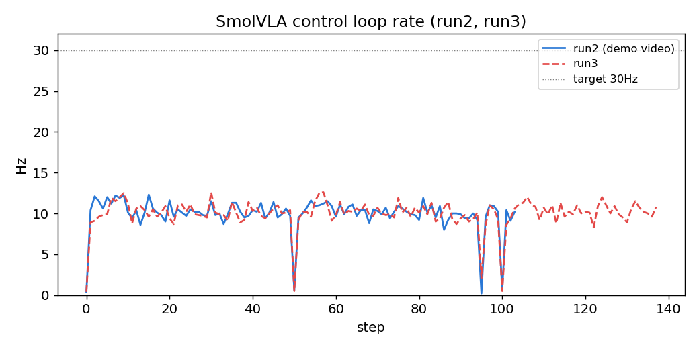
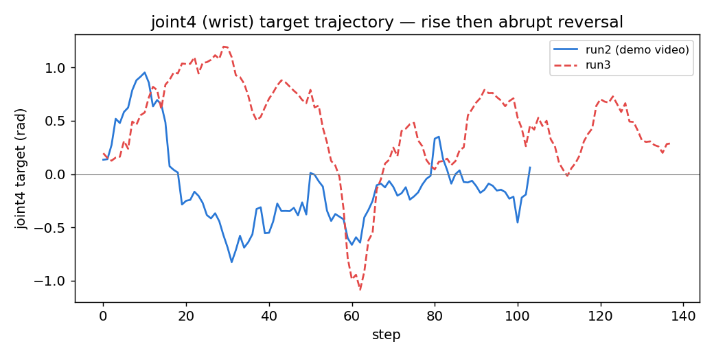
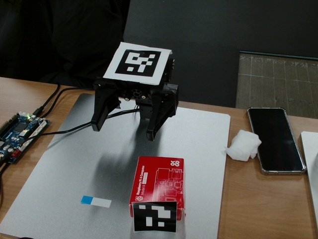
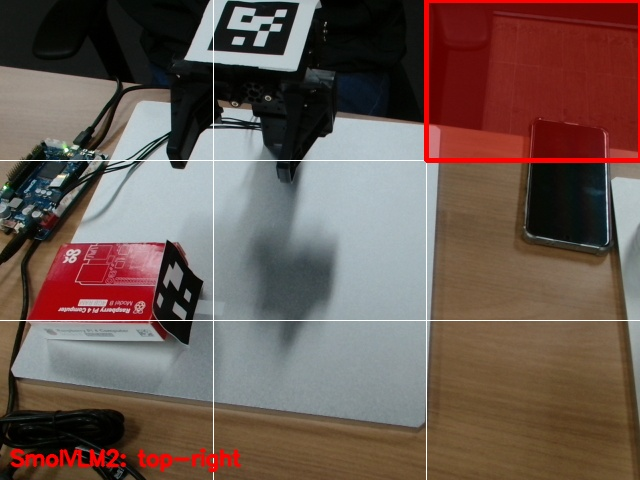
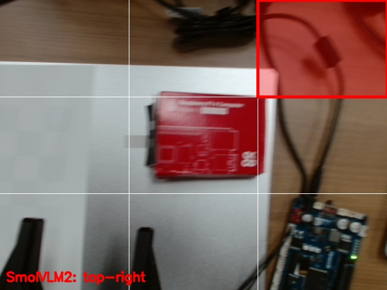
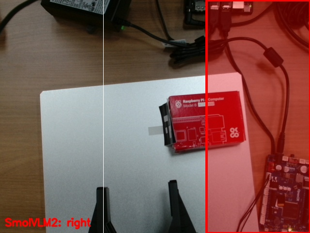

# 재현 가이드북 — OpenManipulator-X 텔레오퍼레이션 & MoveIt2 Pick-and-Place

이 문서만 보고 따라 하면 **환경 세팅부터 MoveIt2로 물체를 집어 옮기는 것까지** 재현할 수 있습니다.
에러가 나면 먼저 [troubleshooting.md](./troubleshooting.md)에서 증상을 검색해 보세요.

- **대상 하드웨어**: OpenManipulator-X (4축), OpenCR 제어보드
- **소프트웨어**: Ubuntu 24.04 LTS, ROS 2 Jazzy Jalisco, MoveIt 2
- **완료 상태**: Stage 1 (텔레오퍼레이션) ✅ · Stage 2 (MoveIt2 pick-and-place) ✅ · Stage 3 (ArUco 인식 파이프라인) ✅ · Stage 3 후속 (자동 캘리브레이션 + ArUco pick-and-place, v3) ✅ · Stage 4 준비 (젯슨 오린 나노 초기 환경 구축) ✅ · Stage 4 (젯슨 워크스페이스 클론/빌드 + 실물 하드웨어 리플레이, 64GB 카드) ✅ · Stage 4 본편 (SmolVLA 온보드 제로샷 추론) ✅

---

## 0. 완료 체크리스트

- [ ] Ubuntu 24.04 + ROS 2 Jazzy 설치
- [ ] MoveIt2 + `moveit_py` 설치
- [ ] ROBOTIS 패키지 4종 클론 & 빌드
- [ ] OpenCR에 `usb_to_dxl` 펌웨어 업로드
- [ ] 브링업 성공 (`/joint_states` 발행 확인)
- [ ] 키보드 텔레오퍼레이션 동작 확인
- [ ] RViz MoveIt 플러그인으로 Plan/Execute 성공
- [ ] `moveit_py` 스크립트로 pick-and-place 9단계 시퀀스 성공

---

## 1. 환경 세팅

### 1.1 OS & ROS 2

- Ubuntu 24.04 LTS 설치 (Rufus로 USB 부팅 디스크 생성 후 설치)
- ROS 2 Jazzy Jalisco 설치: [공식 문서](https://docs.ros.org/en/jazzy/Installation.html)

### 1.2 MoveIt2 설치

```bash
sudo apt update
sudo apt install ros-jazzy-moveit ros-jazzy-dynamixel-sdk
sudo apt install -y ros-jazzy-moveit-py
```

> ⚠️ `ros-jazzy-moveit-py`는 `ros-jazzy-moveit` 메타패키지에 포함되지 **않는 별도 apt 패키지**입니다. Stage 2 스크립트(`from moveit.planning import MoveItPy`)를 쓰려면 반드시 따로 설치해야 합니다. 설치 후 워크스페이스를 다시 source 하세요.

### 1.3 로봇팔 연결 확인

- 사용 보드: **OpenCR** (U2D2 아님)
- 라즈베리파이5에 연결된 포트 확인:
  ```bash
  ls /dev/ttyACM*
  # 예: /dev/ttyACM0
  ```
- 포트 권한 문제 시:
  ```bash
  sudo usermod -aG dialout $USER
  # 로그아웃/재로그인 또는 재부팅 필요
  ```

---

## 2. ROS 패키지 설치 (ROBOTIS 공식)

참고: [OpenManipulator-X Quick Start Guide](https://emanual.robotis.com/docs/en/platform/openmanipulator_x/quick_start_guide/#install-ros-packages)

### 2.1 저장소 클론

```bash
mkdir -p ~/ros2_ws/src
cd ~/ros2_ws/src
git clone -b jazzy https://github.com/ROBOTIS-GIT/DynamixelSDK.git && \
  git clone -b jazzy https://github.com/ROBOTIS-GIT/dynamixel_interfaces.git && \
  git clone -b jazzy https://github.com/ROBOTIS-GIT/dynamixel_hardware_interface.git && \
  git clone -b jazzy https://github.com/ROBOTIS-GIT/open_manipulator.git
```

### 2.2 의존성 설치

```bash
cd ~/ros2_ws
sudo rosdep init
rosdep update
rosdep install -i --from-path src --rosdistro $ROS_DISTRO \
  --skip-keys="librealsense2 dynamixel_hardware_interface dynamixel_interfaces dynamixel_sdk open_manipulator robotis_interfaces" \
  -y
```

### 2.3 빌드 & source

```bash
colcon build --symlink-install --cmake-args -DCMAKE_BUILD_TYPE=Release
source ~/ros2_ws/install/setup.bash
```

`~/.bashrc`에 추가해두면 편합니다:

```bash
echo "source /opt/ros/${ROS_DISTRO}/setup.bash" >> ~/.bashrc
echo "source ~/ros2_ws/install/setup.bash" >> ~/.bashrc
echo "alias cb='colcon build --symlink-install --cmake-args -DCMAKE_BUILD_TYPE=Release'" >> ~/.bashrc
source ~/.bashrc
```

### 2.4 udev 규칙 생성

```bash
ros2 run open_manipulator_bringup om_create_udev_rules
```

---

## 3. OpenCR 펌웨어 업로드 (Arduino IDE)

전원을 켜기 전에 이 단계를 마쳐야 합니다. **여기를 건너뛰면 ROS2 통신 시
`[TxRxResult] There is no status packet!` 오류가 발생합니다.**

### 3.1 32비트 컴파일러 (Ubuntu 24.04 대응)

매뉴얼의 `libncurses5-dev:i386`은 24.04(Noble)에서 제공되지 않습니다. 아래로 대체하세요.

```bash
sudo dpkg --add-architecture i386
sudo apt update
sudo apt install libc6:i386 libncurses6:i386 libstdc++6:i386
```

> 증상: 위 패키지 없이 업로드 시 `arm-none-eabi-g++: no such file or directory` (파일은 있는데 32비트 동적 링커가 없어서 발생).

### 3.2 Arduino IDE 설치 & 실행

```bash
# https://www.arduino.cc/en/software 에서 Linux 64bit용 zip 다운로드 후
cd ~/Downloads
unzip arduino-ide_2.3.10_Linux_64bit.zip -d ~/tools/
cd ~/tools/arduino-ide_2.3.10_Linux_64bit
./arduino-ide --no-sandbox    # sandbox 에러 회피 (SUID sandbox helper 에러 시 필수)
```

alias 등록:

```bash
echo "alias arduino-ide='~/tools/arduino-ide_2.3.10_Linux_64bit/arduino-ide --no-sandbox'" >> ~/.bashrc
source ~/.bashrc
```

### 3.3 OpenCR 보드 패키지 설치

1. USB 포트 권한 설정:
   ```bash
   wget https://raw.githubusercontent.com/ROBOTIS-GIT/OpenCR/master/99-opencr-cdc.rules
   sudo cp ./99-opencr-cdc.rules /etc/udev/rules.d/
   sudo udevadm control --reload-rules
   sudo udevadm trigger
   ```
2. Arduino IDE 실행 → `File → Preferences` → Additional Boards Manager URLs에 추가:
   ```
   https://raw.githubusercontent.com/ROBOTIS-GIT/OpenCR/master/arduino/opencr_release/package_opencr_index.json
   ```
3. OpenCR을 USB로 연결한 상태에서 포트 먼저 설정합니다.

   
   

4. `Tools → Board → Boards Manager`에서 `OpenCR` 검색 후 설치.

   

5. `Tools → Board`에 OpenCR Board가 뜨는지 확인 후 선택.

   

6. modemmanager 제거 (업로드 후 재연결 시 AT 명령 충돌 방지):
   ```bash
   sudo apt-get purge modemmanager
   ```

### 3.4 usb_to_dxl 펌웨어 업로드

1. `File → Examples → OpenCR → 10.Etc → usb_to_dxl` 예제 열기
2. Upload 클릭
3. 업로드 완료 로그 확인

> 업로드 실패 시 Recovery Mode: 전원 ON → `PUSH SW2` 누른 채 `Reset` 눌렀다 떼기 → `PUSH SW2` 떼기. STATUS LED가 100ms 간격으로 깜빡이면 성공.

업로드 완료 후 전원을 켜면 모든 DYNAMIXEL LED가 한 번씩 깜빡여야 정상입니다.

---

## 4. 브링업 & 텔레오퍼레이션 (Stage 1)

> **[포트 지정 필수]** `open_manipulator_x.launch.py`의 `port_name` 기본값은 U2D2용(`/dev/ttyUSB0`)입니다. OpenCR을 쓰므로 `port_name:=/dev/ttyACM0`을 반드시 명시하세요. 누락 시 `Error opening serial port!`가 반복 발생합니다.

### 4.1 브링업

```bash
ros2 launch open_manipulator_bringup open_manipulator_x.launch.py port_name:=/dev/ttyACM0
```

이 터미널을 켜둔 채로 아래 명령을 다른 터미널에서 실행합니다 (`/joint_states` 토픽이 브링업 노드에서 나오기 때문).

### 4.2 키보드 텔레오퍼레이션

```bash
ros2 run open_manipulator_teleop open_manipulator_x_teleop
```

패키지명이 버전에 따라 다를 수 있습니다. 안 되면 `ros2 pkg list | grep teleop`으로 확인하세요.

### 4.3 GUI 조작 (선택)

```bash
# 터미널 1: 브링업 (위 4.1)
# 터미널 2:
ros2 launch open_manipulator_moveit_config open_manipulator_x_moveit.launch.py
# 터미널 3:
ros2 launch open_manipulator_gui open_manipulator_x_gui.launch.py
```

### 4.4 RViz에서 목표 자세 Plan & Execute 확인

MoveIt 플러그인 인터랙티브 마커를 드래그 → Plan → Execute로 실물 팔이 움직이는지 확인합니다. `arm`/`gripper` 두 planning group이 정상 동작해야 다음 단계로 넘어갈 수 있습니다.


---

## 5. MoveIt2 Pick-and-Place (Stage 2)

**목표**: 고정된 좌표의 물체를 집어서 다른 고정된 좌표에 놓는 동작을 `moveit_py`로 스스로 경로 계획해서 수행. (카메라 인식 없음 — Stage 3 예정. 좌표는 하드코딩)

참고 매뉴얼:
- [MoveIt2 Your First Project](https://moveit.picknik.ai/main/doc/tutorials/your_first_project/your_first_project.html)
- [automaticaddison pick-and-place tutorial](https://automaticaddison.com/pick-and-place-task-using-moveit-2-and-perception-ros2-jazzy/)

### 5.1 사전 준비 (Stage 1에서 이어짐)

```bash
# 터미널 1
ros2 launch open_manipulator_bringup open_manipulator_x.launch.py port_name:=/dev/ttyACM0
# 터미널 2 (RViz 시각 확인용, 선택 - 아래 5.2 업데이트 참고. pick_and_place.py를
# 돌릴 땐 이 터미널을 끄고 브링업만 있는 상태로 실행할 것)
ros2 launch open_manipulator_moveit_config open_manipulator_x_moveit.launch.py
```

### 5.2 아키텍처 노트: `moveit_py`는 클라이언트가 아니다

`moveit_py`의 `MoveItPy` 클래스는 `MoveItCpp`를 감싼 것으로, 이미 떠 있는 `move_group` 노드에 붙는 얇은 클라이언트(RViz가 쓰는 C++ `MoveGroupInterface` 방식)가 **아닙니다.** 스크립트 프로세스 안에 독립된 두 번째 플래닝 파이프라인이 새로 뜨는 구조입니다.

**실무적 의미**: 스크립트를 돌리는 동안 RViz의 Plan/Execute를 **동시에 쓰지 마세요.** 둘 다 같은 `arm_controller`/`gripper_controller`에 goal을 보내 충돌할 수 있습니다.

> ⚠️ **업데이트 (Stage 3 후속에서 재현됨)**: "시각화 확인용으로만 RViz를 켜두는 건 괜찮다"는 위 설명은 더 이상 유효하지 않을 수 있습니다. `open_manipulator_moveit_config`의 moveit launch(=`move_group`)가 **떠 있기만 해도**, RViz로 아무것도 조작하지 않았는데 `moveit_py` 스크립트의 planning이 "Unable to sample any valid states for goal tree"로 항상 실패하는 현상이 재현됐습니다 (2단계 원본 `pick_and_place.py`로도 동일 재현 — 두 개의 planning scene 추적기가 충돌하는 것으로 추정). **`moveit_py` 스크립트를 돌릴 땐 moveit launch 자체를 켜지 말고 브링업만 켜두세요.**

### 5.3 패키지 구조

기존 ROBOTIS 벤더 패키지(`open_manipulator/`)와 분리된 독립 패키지로 생성했습니다. 업스트림 추적 코드와 과제 코드를 섞지 않기 위함이며, Stage 3(카메라 인식) 확장을 고려한 구조입니다.

```
~/ros2_ws/src/open_manipulator_x_pick_place/   (ament_python)
├── package.xml          # depend: rclpy, moveit_py, geometry_msgs
├── setup.py
├── setup.cfg
├── resource/open_manipulator_x_pick_place
└── open_manipulator_x_pick_place/
    ├── __init__.py
    └── pick_and_place.py
```

### 5.4 코드 구조 요약

- **설정 상수**: `ARM_GROUP`/`GRIPPER_GROUP`("arm"/"gripper"), SRDF named state(`home`, `open`/`close`), `GRASP_POSITION`/`PRE_GRASP_POSITION`(좌표), `PRE_PLACE_JOINT_POSITIONS`/`PLACE_JOINT_POSITIONS`(관절값 — 이유는 troubleshooting 참고), velocity/acceleration scaling 0.2 고정.
- **`build_moveit_py()`**: `MoveItConfigsBuilder`로 기존 `open_manipulator_moveit_config` 패키지의 srdf/joint_limits/controllers/kinematics를 그대로 읽어 `MoveItPy` 인스턴스 생성.
- **`plan_and_execute()`**: 모든 이동의 공통 안전 로직 — `set_start_state_to_current_state()` → `plan()` → **실패 시 로그만 남기고 즉시 반환 (execute 호출 안 함)** → 성공 시 `execute()` → 다음 planning 전 0.5초 대기.
- **이동 방식 3가지**: `move_arm_to_named_state()` (SRDF named state), `move_arm_to_pose()` (좌표, IK는 MoveIt이 계산), `move_arm_to_joint_positions()` (관절값 직접 지정, IK 계산 생략).
- **`run_pick_and_place()` 9단계**: home → pre-grasp(좌표) → grasp(좌표) → gripper close → lift(좌표) → pre-place(관절값) → place(관절값) → gripper open → retreat+home(관절값→named state).
- **`main()`**: `rclpy.init()` → `MoveItPy` 생성 → 시퀀스 실행 → 정상 종료 대신 `os._exit()`로 강제 종료 (이유는 troubleshooting #3 참고).

### 5.5 좌표/관절값 뽑는 법 — 수동교시(hand-teaching)

RViz 드래그+Plan+Execute를 반복하는 것보다 훨씬 빠르고 정확합니다.

1. **토크 끄기** (팔이 손으로 자유롭게 움직여짐):
   ```bash
   ros2 service call /dynamixel_hardware_interface/set_dxl_torque std_srvs/srv/SetBool "{data: false}"
   ```
   ⚠️ 토크가 꺼지는 순간 팔이 자중으로 축 늘어집니다 — 호출 직전에 반드시 손으로 받치세요.
2. 원하는 위치로 손으로 옮깁니다. (`/joint_states`가 실시간으로 실제 인코더 값을 반영)
3. **좌표 읽기**:
   ```bash
   ros2 run tf2_ros tf2_echo world end_effector_link
   ```
4. **관절값 읽기**:
   ```bash
   ros2 topic echo /joint_states --once
   ```
5. **측정 끝나면 토크 다시 켜기** (필수 — 안 하면 팔이 명령에 반응 안 함):
   ```bash
   ros2 service call /dynamixel_hardware_interface/set_dxl_torque std_srvs/srv/SetBool "{data: true}"
   ```

### 5.6 실행

```bash
# 브링업이 켜져 있고 토크가 켜져 있는지 확인
source ~/ros2_ws/install/setup.bash
python3 ~/ros2_ws/src/open_manipulator_x_pick_place/open_manipulator_x_pick_place/pick_and_place.py
```

RViz/move_group은 **동시에 조작하지 마세요** (Plan/Execute 겹치면 안 됨).

### 5.7 안전 설계

- velocity/acceleration scaling factor 기본 0.2로 낮게 고정
- 매 스텝 `plan()` 결과를 확인, **실패 시 execute() 호출 없이 시퀀스 즉시 중단**
- 각 waypoint 진입/완료 시 로그 출력 (`[N. 스텝이름] planning...` → `done.` 또는 `FAILED`)
- 4축 팔 IK 실패(`Unable to sample any valid states`)도 에러로 감지되어 안전하게 정지

에러가 나면 [troubleshooting.md](./troubleshooting.md)를 확인하세요.

---

## 6. 세션별 자동 캘리브레이션 + ArUco Pick-and-Place (Stage 3 후속, v3)

**목표**: 카메라(구스넥 클램프, 매 세션 재설치)와 로봇팔 사이의 좌표 변환을 하드코딩 대신 **세션 시작 시마다 자동으로 계산**하고, 그 변환으로 물체 마커 좌표를 base 좌표계로 옮겨 pick-and-place를 실행.

> 실물 하드웨어로 캘리브레이션 → ID 1 마커 물체 pick-and-place까지 end-to-end 성공 확인했습니다. 겪은 문제와 해결 과정은 [troubleshooting.md](./troubleshooting.md)의 "Stage 3 후속" 항목에 정리했습니다.

### 6.1 ArUco 마커 ID 역할 분리

| ID | 용도 |
| --- | --- |
| 0 | 캘리브레이션 전용 (그리퍼에 부착) |
| 1 | 물체 A → `MARKER_ID_TO_PLACE_JOINT_POSITIONS[1]` 위치 |
| 2~4 | 물체 B~D (현재 placeholder, 미설정) |

캘리브레이션 마커와 물체 마커는 **동일한 물리 크기**로 인쇄해야 합니다 (`aruco_parameters.yaml`의 `marker_size`가 전역 하나뿐이라 ID별 크기 보정이 없음).

그리퍼처럼 어두운/검은 표면에 붙일 마커는 `generate_aruco_marker.py --margin <px>` 옵션으로 흰색 여백(quiet zone)을 둘러서 생성해야 합니다 (기본은 `--size`의 25%). 마커 검출은 검정 테두리 바깥의 흰색과의 대비로 사각형 윤곽을 찾는 방식이라, 여백 없이 검은 배경에 바로 붙이면 배경과 마커 테두리가 합쳐져서 아예 인식이 안 됩니다.

ID 구분은 `/aruco_poses` (`PoseArray`, marker_id 없음)가 아니라 **`/aruco_markers`** (`aruco_interfaces/ArucoMarkers`: `marker_ids[]` + `poses[]`, 인덱스로 매칭)를 구독해서 처리합니다.

### 6.2 기준 좌표계: `world` (base_link 아님)

`open_manipulator_x.urdf`에는 `base_link`라는 프레임이 없고, 루트 링크 이름이 `world`입니다 (`world_fixed` 조인트로 `link1`에 고정 연결). Stage 2 `pick_and_place.py`도 이미 `BASE_FRAME = 'world'`를 사용하므로, 캘리브레이션이 계산하는 변환과 pick-and-place의 TF 조회 대상도 모두 `world`로 통일했습니다.

### 6.3 패키지 구조

새 패키지를 만들지 않고 기존 `open_manipulator_x_pick_place`에 스크립트 2개를 추가하는 방식을 택했습니다 (MoveItPy 초기화·이동 헬퍼 함수를 그대로 재사용하기 위함, Stage 2 `pick_and_place.py`는 수정하지 않음).

```
open_manipulator_x_pick_place/
├── pick_and_place.py               # Stage 2, 변경 없음 (헬퍼 함수 재사용 대상)
├── calibrate_camera_to_base.py     # 신규 — 캘리브레이션 노드
└── pick_and_place_aruco.py         # 신규 — ArUco 기반 pick-and-place
```

### 6.4 `calibrate_camera_to_base` 로직

1. 시작 전 안전 안내 배너 출력 + Enter 입력 대기.
2. `CALIBRATION_WAYPOINTS_JOINT_POSITIONS`(관절값 리스트 4개, RViz 드래그+Execute로 손교시하여 확보 — 각 자세에서 `/aruco_markers`에 ID 0이 실제로 찍히는지 확인하면서 잡음)를 순서대로 방문. 각 웨이포인트는 `move_arm_to_joint_positions()`로 이동 — planning 실패 시 그 자리에서 로그 남기고 즉시 `os._exit(1)` (다음 웨이포인트로 넘어가지 않음).
3. 웨이포인트 도착마다:
   - FK: `planning_scene_monitor.read_only().current_state.get_pose(EE_LINK)` → TCP pose (`world` 기준, position + orientation)
   - `/aruco_markers`에서 ID 0 포즈를 5프레임(기본값, `settle_frames` 파라미터) 평균
   - **마커-TCP 오프셋 보정**: ID 0 마커는 `end_effector_link` 원점이 아니라 그리퍼 표면에 붙어 있어 실측 약 8cm(손목 쪽, EE 로컬 -x 방향, `MARKER_OFFSET_IN_EE_FRAME`)만큼 떨어져 있음. 이 오프셋을 그냥 무시하면 웨이포인트마다 그리퍼가 회전할 때 오프셋도 같이 회전해서 강체 변환 가정이 깨지고 계산이 재현 가능하게(=랜덤 노이즈가 아니게) 틀어짐. TCP 위치 + `R(TCP 방향) @ MARKER_OFFSET_IN_EE_FRAME`로 "마커의 실제 world 좌표"를 역산해서 Kabsch에 넣음.
   - 위 과정 중 하나라도 실패(타임아웃)하면 캘리브레이션 중단
4. 웨이포인트 4개의 (world 좌표, camera 좌표) 쌍이 모이면 NumPy SVD 기반 Kabsch로 회전 `R`, 이동 `t` 계산 (`R,t: world ≈ R @ camera + t`), `scipy.spatial.transform.Rotation`으로 쿼터니언 변환.
5. `tf2_ros.StaticTransformBroadcaster`로 `world -> camera_frame` 정적 TF를 한 번 publish. 이후 `rclpy.spin()`으로 살아있음 유지 (터미널을 닫으면 안 됨 — TF가 늦게 붙는 구독자에게도 전달되려면 노드가 계속 떠 있어야 함).

검산 방법(재현 가능): 4개 웨이포인트의 (world, camera) 점들 사이의 pairwise 거리를 각각 구해서 비율을 비교 — 강체 변환이면 두 좌표계에서 거리가 같아야 함. 마커-TCP 오프셋 보정 전에는 비율이 1.19~1.57로 들쭉날쭉했고, 보정 후 대부분 1.0 근처로 좁혀지며 Kabsch 잔차도 1cm 이하로 줄었음.

### 6.5 `pick_and_place_aruco` 로직

- 원샷 방식: `/aruco_markers`에서 ID 1~4 중 하나라도 포함된 메시지가 오면, 그 ID(들)에 한해 5프레임 평균(캘리브레이션과 동일한 노이즈 감소 방식)을 낸 뒤 pick-and-place 1회만 실행 (지속적으로 재시도하는 루프 아님).
- 검출된 마커들을 순서대로 시도: `tf2_ros.Buffer.transform()`으로 `world` 좌표로 변환 → pre-grasp 자세 시도 → **실패하면 그 마커는 건너뛰고 다음 후보로** (IK 도달 불가 시 팔 무리하게 뻗지 않음).
  - `tf2_ros.Buffer.can_transform()`/`transform()`은 timeout 동안 그냥 busy-sleep만 하고 노드를 spin하지 않는 알려진 제약이 있어(ros2/geometry2 issue #327), TF가 아직 안 왔으면 timeout을 아무리 늘려도 영원히 못 받음. `can_transform()`이 참이 될 때까지 직접 `rclpy.spin_once()`를 돌려준 뒤에 `transform()`을 호출하도록 처리.
- **pre-grasp/grasp는 좌표(pose) 목표가 아니라 관절값(joint-space) 목표로 실행** (`move_arm_to_pose_seeded()`): `arm`은 position-only IK라 여유자유도가 1개 있는데, OMPL이 pose 목표에 대해 자체적으로 고르는 IK 시드가 자꾸 자기충돌하는 해로 수렴해서 Stage2 검증 좌표와 1cm 이내로 가까운 목표조차 계속 실패했음 (Stage 2가 pre-place/place에서 이미 겪은 것과 동일 증상 — 그쪽은 손교시 관절값으로 우회). 카메라로 실시간으로 받는 좌표는 미리 손교시할 수 없으므로, **`RobotState.set_from_ik()`를 home 자세(전부 0) 시드로 직접 호출**해서 관절값을 구한 뒤 그 값으로 `move_arm_to_joint_positions()` 실행 — OMPL의 자체 IK 샘플링을 우회.
- pre-grasp planning이 성공해 실제로 하강을 시작한 이후 단계가 실패하면 (물체를 이미 집었을 수 있으므로) 다음 마커로 넘어가지 않고 **그 자리에서 전체 시퀀스 중단** — Stage 2와 동일한 안전 원칙.
- `MARKER_ID_TO_PLACE_JOINT_POSITIONS` 딕셔너리로 ID→목적지 관절값 매핑 (ID 1은 Stage 2 값 재사용, 2~4는 손교시 필요·현재 미설정).
- **`GRASP_X_OFFSET`/`GRASP_Y_OFFSET`/`GRASP_Z_OFFSET`**: depth 카메라 없이 단안(monocular) ArUco `solvePnP`로만 위치를 추정하다 보니, 마커 자체 위치와 실제로 그리퍼가 닫혀야 할 지점 사이에 물체/부착 위치에 따른 오차가 생김. 실물 테스트로 실측한 보정값(X: -0.03, Y: -0.03, Z: -0.02)을 넣어둠 — 물체나 마커 부착 위치가 바뀌면 다시 튜닝 필요.

**아키텍처 노트**: `moveit_py` 스크립트(캘리브레이션, pick-and-place)를 돌릴 때 `open_manipulator_moveit_config`의 moveit launch(`move_group`)를 **동시에 켜두면 안 됩니다.** 둘 다 독립된 planning scene 추적기를 가지고 있어서 충돌하면 어떤 목표를 잡든 IK가 항상 실패합니다 (6.6절 터미널 구성 참고).

### 6.6 실행 순서 (매 테스트 세션마다)

```bash
# 터미널 1: 카메라
# pixel_format 없이 켜면 usb_cam이 "terminate called after throwing an
# instance of 'char*'"로 죽음. image_width/height는 ~/.ros/camera_info/
# default_cam.yaml 캘리브레이션이 1280x720 기준이라 반드시 맞춰야 함
# (안 맞추면 해상도 불일치로 ArUco pose의 z값이 틀어짐). 이 해상도에서
# C920은 30fps가 아니라 실측 약 9~10Hz로 나옴 - 정지 상태 마커 인식 용도로는 충분.
ros2 run usb_cam usb_cam_node_exe --ros-args \
  -p video_device:=/dev/video2 \
  -p pixel_format:=yuyv \
  -p image_width:=1280 \
  -p image_height:=720

# 터미널 2: ArUco 인식
# aruco_pose_estimation.launch.py는 realsense2_camera 패키지를 강제로
# include하려고 시도해서, 이 패키지가 없으면(RealSense 대신 일반 USB
# 웹캠을 쓰는 이 프로젝트에서는 없음) launch 자체가 예외로 죽고 안에서
# 막 뜬 aruco_node.py까지 같이 종료된다. launch 파일 대신 노드를 직접 실행.
# camera_info_topic 기본값도 RealSense용 이름(/camera/color/camera_info)이라
# usb_cam이 실제로 쓰는 /camera_info로 override 필요.
# marker_size는 실제로 인쇄한 마커의 물리 크기(m)로 반드시 맞춰야 z값이
# 정확히 나온다 (기본값 0.2m는 이 프로젝트의 실제 마커 크기와 다름 - 잘못
# 넣으면 solvePnP가 거리를 실제보다 훨씬 멀게/가깝게 계산해서 IK가 안
# 닿는 걸로 나옴). 이 프로젝트의 실측 마커 크기: 58mm = 0.058m.
ros2 run aruco_pose_estimation aruco_node.py --ros-args \
  -p image_topic:=/image_raw \
  -p camera_info_topic:=/camera_info \
  -p camera_frame:=camera_link \
  -p marker_size:=0.058 \
  -p use_depth_input:=false \
  -p aruco_dictionary_id:=DICT_5X5_250

# 터미널 3: 브링업만 (MoveIt launch는 켜지 말 것!)
# moveit_py 스크립트(캘리브레이션, pick-and-place)는 move_group에 붙는
# 클라이언트가 아니라 자기 안에 독립된 두 번째 planning 파이프라인을
# 내장한다 (5.2절). open_manipulator_moveit_config의 moveit launch로
# move_group을 따로 띄운 채 moveit_py 스크립트를 실행하면 두 planning
# scene 추적기가 충돌해서 "Unable to sample any valid states for goal
# tree"가 어떤 목표를 잡든 항상 뜬다 (Stage 2 원본 스크립트로도 재현됨).
# RViz 시각 확인이 필요하면 스크립트를 끈 뒤 별도로 켤 것.
ros2 launch open_manipulator_bringup open_manipulator_x.launch.py port_name:=/dev/ttyACM0

# 터미널 4: 캘리브레이션 (완료 후에도 TF를 계속 유지하기 위해 살아있음 — 닫지 말 것)
ros2 run open_manipulator_x_pick_place calibrate_camera_to_base

# 터미널 5: ArUco pick-and-place (터미널 4의 캘리브레이션이 끝난 뒤 실행)
ros2 run open_manipulator_x_pick_place pick_and_place_aruco
```

### 6.7 안전 설계

- 모든 실물 이동은 Stage 2와 동일하게 velocity/acceleration scaling 0.2로 고정 (`pick_and_place.py`의 상수 재사용).
- 매 웨이포인트/스텝마다 `plan()` 성공 여부를 확인한 뒤에만 `execute()` — 실패 시 그 자리에서 로그 남기고 중단.
- 캘리브레이션 시작 전 터미널에 안전 안내 배너 출력 + Enter 입력으로 사람이 직접 확인 후 진행.
- ArUco pick-and-place는 IK 도달 불가 물체는 건너뛰되, 그리퍼가 이미 닫힌 이후의 실패는 다음 물체로 넘어가지 않고 즉시 중단.

### 6.8 완료 체크리스트

- [x] 캘리브레이션 웨이포인트 4개 손교시로 채우기
- [x] ID 0 마커(그리퍼용) 생성·부착, ID 1과 동일 크기로 인쇄 (여백 포함 — `generate_aruco_marker.py --margin` 참고)
- [x] 캘리브레이션 4개 웨이포인트가 안전하게(느린 속도, planning 실패 시 중단) 순회됨
- [x] 계산된 TF로 물체 마커(ID 1) 좌표를 world로 변환했을 때 실제 물체 위치로 팔이 정확히 이동
- [ ] ID 2~4 물체 놓을 위치 손교시 (선택 — ID 1만으로도 완료 기준 충족했음, 필요 시 추가)
- [x] 마커 1개(ID 1)에 대해 실제로 집어서 지정 위치에 놓기 성공 — end-to-end 확인 완료

---

## 7. 4단계 준비 — 젯슨 오린 나노 초기 환경 구축

Stage 4(온보드 VLA)에 들어가기 전, 젯슨 오린 나노 Developer Kit(8GB)를 개봉 상태에서 SSH 원격 접속이 가능한 상태까지 세팅합니다. 이 절차를 마치면 모니터·키보드 없이 노트북에서 젯슨을 원격으로 다룰 수 있습니다.

### 준비물

- Jetson Orin Nano Developer Kit (8GB, P3767-0005 모듈 + P3768-0000 캐리어보드)
- microSD 64GB 이상 UHS-1 **필수** (32GB로 실제 시도해본 결과, JetPack + ROS 2 Jazzy + 워크스페이스 빌드만으로 용량이 부족해 빌드 도중 중단됨 — VLA 패키지·모델 가중치까지 얹으면 32GB로는 불가능)
- USB 플래시드라이브 16GB 이상 (설치 미디어용 — JetPack 7.2부터 SD카드 이미지 방식 지원 종료)
- DisplayPort 케이블 또는 DP-HDMI 어댑터 (젯슨은 DP 출력만 지원, USB-C/HDMI 자체 출력 없음)
- Ubuntu 24.04 호스트 노트북

### JetPack 버전 선택: 7.2 (6.2.1이 아닌 이유)

ROS 2 Jazzy의 공식 Tier 1 지원 플랫폼은 **Ubuntu 24.04**입니다. JetPack 6.2.1은 Ubuntu 22.04 rootfs라 Jazzy를 공식 지원하지 않는 반면, JetPack 7.2는 Ubuntu 24.04 rootfs로 Jazzy를 공식 지원하고 노트북 OS 버전과도 일치합니다. 따라서 최신 버전인 JetPack 7.2를 선택했습니다.

참고로 JetPack 7.2는 출시 초기라 일부 서드파티 도구(jetson-containers, prebuilt PyTorch wheel 등)가 아직 CUDA 13.2 기준으로 완전히 따라오지 못한 상태입니다. Stage 4 본편(VLA 추론) 진행 시 GPU가 실제로 사용되는지 재검증이 필요합니다.

### 절차

**1. UEFI 펌웨어 버전 확인**

모니터·키보드 연결 후 전원 인가 → 부팅 스플래시에서 Esc 연타 → UEFI 메뉴에서 펌웨어 버전 확인. `36.x` 이상이면 펌웨어 업데이트 없이 바로 진행 가능합니다 (JetPack 7.2 요구사항: JetPack 6.x세대 펌웨어).

**2. JetPack 7.2 ISO 설치 미디어 준비**

NVIDIA JetPack 7.2 페이지에서 Jetson ISO 이미지(arm64)를 다운로드하고, 이미지 굽기 도구로 USB에 씁니다. balenaEtcher에서 문제가 발생하면 GNOME Disks("디스크") 앱을 대안으로 사용합니다.

**3. 젯슨 부팅 & USB에서 설치 실행**

DP 모니터·USB 키보드/마우스·19V 전원을 연결하고, USB 설치미디어와 대상 저장소(microSD) 둘 다 꽂은 채로 부팅합니다. 부팅 스플래시에서 Esc → Boot Manager → USB 디스크를 명시적으로 선택해야 설치가 시작됩니다 (자동 부팅 안 됨).

설치는 microSD 쓰기 속도에 따라 20~30분 이상 걸릴 수 있습니다. 화면이 멈춘 것처럼 보여도 전원을 끊지 말고 대기합니다. 설치 완료 후 "USB 제거" 메시지가 뜨면 제거하고 대상 저장소로 재부팅합니다.

**4. 첫 부팅 초기 설정**

EULA 동의 → 언어/키보드/타임존 → 네트워크(WiFi) → 계정 생성 순으로 진행합니다.

**5. 성능모드 MAXN SUPER 설정**

JetPack 7.2 초기 버전에서는 GUI 전원모드 메뉴에 MAXN SUPER 옵션이 표시되지 않는 알려진 문제가 있습니다. 터미널에서 수동으로 설정합니다:

```bash
sudo ln -sf /etc/nvpmodel/nvpmodel_p3767_0003_super.conf /etc/nvpmodel.conf
sudo nvpmodel -m 2
sudo nvpmodel -q   # MAXN_SUPER 확인
```

재부팅해도 유지되도록 기본값을 변경합니다:

```bash
sudo sed -i 's/DEFAULT=0/DEFAULT=2/' /etc/nvpmodel.conf
sudo reboot
```

**6. SSH 접속 확인**

젯슨에서 `hostname -I`로 IP를 확인합니다 (여러 IP가 나오는데, WiFi로 할당된 IP만 사용 — `192.168.55.1`은 USB-C 전용, `172.17.0.1`은 Docker 내부용이므로 무시). 노트북에서 같은 네트워크에 연결된 상태로 접속합니다:

```bash
ssh <계정명>@<젯슨IP>
```

이 단계를 마치면. 젯슨 오린 나노가 Ubuntu 24.04 + JetPack 7.2 + MAXN SUPER 성능모드로 세팅되고, 노트북에서 SSH로 원격 접속되어 모니터·키보드 없이 이후 작업(ROS 2, CUDA, VLA 모델 설치)을 진행할 수 있습니다.

에러가 나면 [troubleshooting.md](./troubleshooting.md)의 "젯슨 오린 나노 초기 세팅" 항목을 확인하세요.

---

## 8. ROS 2 워크스페이스 클론 & 빌드 (젯슨 단독 온보드) — 64GB 카드로 완료

### 8.1 작업 방식 — 헤드리스 SSH

- 젯슨에 모니터·키보드 연결 안 하고 노트북 터미널 → SSH 접속으로 전부 진행. 접속: `ssh csilab@<젯슨 WiFi IP>` (DHCP라 매번 바뀔 수 있음, 안 붙으면 USB-C 직결 `192.168.55.1`로 우회)
- 긴 작업(빌드·설치)은 tmux 세션 안에서 실행 — SSH가 끊겨도 작업이 죽지 않음

  ```bash
  sudo apt install tmux -y
  tmux new -s stage4
  # 끊기면 재접속 후: tmux attach -t stage4
  ```

- SSH 터미널 여러 개 동시 접속은 문제없이 확인됨

### 8.2 Stage 4 아키텍처 확정 — 젯슨 단독 온보드 (노트북 완전 분리)

담당 선배 요구사항 확인: 노트북을 로봇팔에 유선 연결해서 뭔가를 처리하는 게 아니라, **엣지 디바이스(젯슨) 하나만 로봇에 연결해서 브링업부터 pick-and-place, VLA 추론까지 전 과정을 젯슨 단독으로 돌리는 것** 자체가 이번 단계의 의미. 노트북은 로봇과의 연결선이 전혀 없고, 기껏해야 SSH로 젯슨을 모니터링하는 용도로만 쓰입니다.

```
[젯슨: 카메라 + OpenCR 시리얼(팔) 둘 다 연결]
  → 브링업 (open_manipulator_bringup)
  → 인식 (ros2-aruco-pose-estimation)
  → 판단·집기 (MoveIt2 pick-and-place → 이후 VLA로 대체)
노트북: 물리적 연결 없음 (SSH 원격 모니터링만, 필요 시)
```

즉 **워크스페이스 전체**(하드웨어 드라이버 `dynamixel_hardware_interface`, `open_manipulator`의 bringup/moveit_config/컨트롤러류, 인식 패키지, pick-and-place 패키지)를 젯슨에서 빌드해야 합니다. OpenCR과 카메라도 실제로 젯슨에 물리적으로 옮겨 연결해야 합니다.

> **정정**: 이 문서에 잠시 "젯슨=카메라+VLA만, 팔 제어는 노트북이 담당하는 분산 구조"로 적었던 버전이 있었는데, 이는 별개 대화에서 요구사항을 잘못 해석해 내린 결론이라 폐기합니다. GUI(`open_manipulator_gui`)·teleop·playground처럼 이 과제 자체에 필수는 아닌 패키지도 있지만, 젯슨 단독 완결성을 위해 워크스페이스 전체를 빌드하는 쪽으로 진행합니다. Day 1에 `om_gravity_compensation_controller` 빌드 문제를 해결한 것도 그대로 유효합니다 (아래 8.5, [troubleshooting.md](./troubleshooting.md) 참고).

### 8.3 GitHub SSH 연동

```bash
ssh-keygen -t ed25519 -C "jetson-yhy"
cat ~/.ssh/id_ed25519.pub   # GitHub Settings > SSH keys 에 등록
ssh -T git@github.com       # 확인
git config --global user.name "<이름>"
git config --global user.email "<이메일>"
```

이후 클론·푸시 시 토큰 입력이 필요 없습니다. **SD카드를 새로 구우면 키가 사라지므로 재발급 필요.**

### 8.4 절차 (재개 시 이 순서 그대로)

```bash
# 1. 기본 도구 (최소 설치 이미지라 아래 전부 별도 설치 필요)
sudo apt update
sudo apt install build-essential cmake git python3-colcon-common-extensions python3-rosdep nano tmux python3-pip -y

# 2. ROS 2 Jazzy (공식 설치 가이드 참고, 섹션 1~6 노트북 설치 절차와 동일)
sudo apt install ros-jazzy-ros-base -y

# 3. GitHub SSH 키 재설정 (8.3 참고)

# 4. 레포 클론 — 목적지를 ros2_ws로 직접 지정 (레포명 그대로 클론하면 한 겹 더 들어가서 mv로 다시 올려야 함)
git clone git@github.com:<계정>/MoveIt2gather.git ~/ros2_ws
cd ~/ros2_ws

# 5. 워크스페이스 전체 빌드 (8.2 아키텍처 기준 — 젯슨 단독 온보드이므로 전체 필요)
rosdep update
rosdep install --from-paths src --ignore-src -r -y
colcon build --symlink-install --executor sequential --parallel-workers 1

# 6. PyTorch — nvidia-jetpack 풀 설치는 건너뛰고 pip wheel부터 (8.6 참고)
pip3 install torch torchvision --index-url https://download.pytorch.org/whl/cu132 --break-system-packages
python3 -c "import torch; print(torch.cuda.is_available())"
```

`--executor sequential --parallel-workers 1`을 쓰는 이유: 젯슨 오린 나노는 램이 크지 않아서 여러 패키지를 동시에 컴파일하면 컴파일러가 메모리 부족으로 죽거나 빌드 캐시가 반쯤만 쓰인 채로 남는 문제가 생기기 쉽습니다 (Day 1에 `om_gravity_compensation_controller`에서 실제로 겪음, 8.5·[troubleshooting.md](./troubleshooting.md) 참고). 순차 빌드는 느리지만 안전합니다.

### 8.5 진행 상황 (Day 1~2, 2026-07-22 기준 — 32GB 카드에서, 64GB 재굽기 전)

- `aruco_interfaces`, `dynamixel_interfaces`, `dynamixel_sdk`, `dynamixel_sdk_custom_interfaces`, `open_manipulator_description`, `om_gravity_compensation_controller` — 개별 빌드 성공 확인 (`om_gravity_compensation_controller`는 병렬 빌드 캐시 손상 문제를 `rm -rf build/install` + 순차 재빌드로 해결한 뒤 성공)
- 워크스페이스 전체 빌드를 진행하기 전, `nvidia-jetpack` 풀 설치(CUDA 툴킷+cuDNN+TensorRT, 수 GB) 시도 중 **32GB microSD 용량 초과(22G/28G, 82% 사용 시점)로 중단**
- 64GB microSD로 재굽기 결정 (8.6, 8.7, 8.8 참고) — 재개 시 워크스페이스 전체를 8.4의 5번 명령(`--executor sequential`)으로 처음부터 다시 빌드

### 8.5-2 진행 상황 (Day 3, 2026-07-23 — 64GB 카드, 완료)

- ROS 2는 `ros-jazzy-ros-base` 대신 `ros-jazzy-desktop`으로 설치 (약 3GB 추가 소비 — 64GB 카드에서는 여유가 충분해 문제 없었음. GUI 자체는 헤드리스 아키텍처상 젯슨에서 직접 쓸 일은 없음)
- 워크스페이스 전체 빌드 성공: `colcon build --symlink-install --executor sequential --parallel-workers 1` — 19개 패키지 전부 `Finished`, 실패 없음 (`open_manipulator_gui`/`open_manipulator_playground`의 stderr 출력은 Qt 빌드 경고로 무해)
  - 빌드 도중 전원 케이블이 실수로 뽑혀 tmux 세션째로 재부팅된 사고 발생 — colcon의 증분 빌드 덕분에 완료된 패키지는 다시 안 돌고 이어서 진행됨 (자세한 원인/대응은 troubleshooting.md 참고)
- PyTorch(`torch==2.13.0+cu132`) pip wheel 설치 완료, `nvidia-jetpack` 풀 설치는 생략 (8.6 전략대로)
- **GPU 검증 완료**: `torch.cuda.is_available()` `True`, `matmul` 정상, `bert-base-uncased` forward pass도 NaN 없이 정상 — Orin(`sm_87`)이 wheel에 명시 지원 안 된다는 경고가 뜨지만(8.7 참고) 실측으로는 PTX JIT 경로가 정상 동작함을 확인. VLA 본편에서 더 복잡한 모델로 재검증 권장은 유효.
- 최종 디스크 사용량: 19G/57G(35%) — 여유 충분
- OpenCR(`/dev/ttyACM0`)·로지텍 C920(`/dev/video0`, 노트북 때의 `/dev/video2`와 다름)을 노트북에서 뽑아 젯슨에 물리적으로 연결 완료, `~/.ros/camera_info/default_cam.yaml`은 노트북에서 `scp`로 이전
- Stage 1(브링업+텔레오퍼레이션) · Stage 3 후속(자동 캘리브레이션 + ArUco pick-and-place)까지 노트북과 동일한 코드로 젯슨 단독 실행 성공 확인. 겪은 이슈(직렬포트 권한, USB 허브 공유, 그리퍼 관절범위 초과 등)는 troubleshooting.md의 "젯슨 단독 온보드 — 하드웨어 리플레이" 항목 참고

### 8.6 CUDA / PyTorch 설치 전략

`nvidia-jetpack` 풀 설치(시스템 전역 CUDA 툴킷 `nvcc`, 수 GB)는 **당장은 필요하지 않을 가능성이 높습니다**:

- `pip install torch` wheel 자체가 CUDA 런타임 라이브러리를 함께 설치함
- 시스템 전역 CUDA 툴킷(`nvcc`)은 PyTorch를 **소스에서 직접 빌드해야 할 때만** 필요 (예: 아래 8.7의 sm_87 커널 갭 문제로 재빌드가 필요한 경우)

재개 시 권장 순서: `nvidia-jetpack` 전체 설치는 건너뛰고, pip wheel로 먼저 GPU 인식 여부를 가볍게 확인합니다 (8.4의 6번 명령).

### 8.7 GPU 검증 시 주의 — JetPack 7.2 특유 이슈

Orin의 컴퓨트 capability(`sm_87`)가 PyTorch 공식 wheel에 명시적으로 포함돼 있지 않아서, 단순 연산(matmul)은 PTX JIT 컴파일로 정상 동작하지만 **transformer/diffusion 같은 복잡한 커널에서 조용히 NaN이 나오는 사례가 확인됨**. `torch.cuda.is_available()`이 `True`인 것만으로 안심하지 말고, 실제 transformer forward pass까지 NaN 체크가 필요합니다:

```python
import torch
x = torch.rand(1000, 1000).cuda()
z = x @ x
print("matmul 정상:", not torch.isnan(z).any().item())

from transformers import AutoModel, AutoTokenizer
model = AutoModel.from_pretrained("bert-base-uncased").cuda()
tok = AutoTokenizer.from_pretrained("bert-base-uncased")
out = model(**tok("test sentence", return_tensors="pt").to("cuda"))
print("transformer 정상:", not torch.isnan(out.last_hidden_state).any().item())
```

여기서 NaN이 나오면 `TORCH_CUDA_ARCH_LIST="8.7"`로 PyTorch를 소스 빌드해야 할 수 있습니다 (시간이 오래 걸리므로 별도 세션으로 계획).

### 8.8 SD카드 재굽기 — 재개 체크리스트

32GB로는 ROS 2 + 워크스페이스 전체 빌드(GUI/컨트롤러 포함) + PyTorch + SmolVLA/LeRobot + 모델 가중치를 다 감당하지 못했습니다. 젯슨 단독 온보드(8.2)로 가는 이상 워크스페이스를 줄일 수 없으므로 카드 용량을 키우는 쪽으로 대응합니다.

- [x] 64GB microSD로 재굽기 결정
- [x] 재굽기 (섹션 7 절차 반복)
- [x] 재굽기 후 8.4 절차를 처음부터 순서대로 (기본 도구 → ROS 2 → SSH 키 재발급 → 클론 → **워크스페이스 전체 빌드** → PyTorch) — 8.5-2 참고
- [x] OpenCR·카메라를 노트북에서 뽑아 젯슨에 물리적으로 연결 (8.2 아키텍처 반영)
- [x] 설치 명령 하나 돌릴 때마다 `df -h /` 습관적으로 체크 — 최종 19G/57G(35%)로 여유 확보

에러가 나면 [troubleshooting.md](./troubleshooting.md)의 "젯슨에서 ROS 2 워크스페이스 빌드" / "젯슨 단독 온보드 — 하드웨어 리플레이" 항목을 확인하세요.

### 8.9 Stage 4 본편 — VLA 모델(SmolVLA) 온보드 제로샷 추론

과제 안내문에 제시된 3개 후보 모델 중 **SmolVLA(LeRobot)**를 가장 가벼운(용량·연산량) 모델로 우선 시도. 온보드에서 실제로 돌아갔고(뒤에 정리한 성능 데이터 참고), 나머지 2개 모델(OpenVLA 7B급, OpenPI 3B급)은 시도하지 않기로 결정 — 젯슨 오린 나노 8GB 메모리로는 로드 자체가 안 될 위험이 크고, SmolVLA가 이미 "안 되는" 상황이 아니라 온보드에서 관측 가능한 결과를 냈기 때문에 굳이 넘어갈 필요가 없다고 판단.

#### 아키텍처

- 설치는 시스템 ROS 2 설치와 완전히 분리된 **conda 환경**(`~/miniforge3`, env명 `vla`, python 3.12 — 시스템 rclpy와 ABI를 맞추기 위해 고정)에서 진행. env 안에서 `source /opt/ros/jazzy/setup.bash`로 시스템 rclpy를 그대로 import해서 씀.
- **`lerobot-ros`**(`ycheng517/lerobot-ros`, PyPI 미배포 — `~/lerobot-ros`에 git clone 후 `pip install -e`)의 `ROS2Robot`/`ROS2Config`를 서브클래싱해서 우리 로봇 전용 패키지 **`lerobot_robot_open_manipulator_x`**를 신규 작성 (`~/lerobot_robot_open_manipulator_x`, `ros2_ws` 밖 — ament 패키지 아닌 순수 pip 패키지):
  - `action_type=ActionType.JOINT_TRAJECTORY` → `/arm_controller/joint_trajectory`에 publish (컨트롤러 이름이 코드에 하드코딩되어 있는데 우리 `arm_controller`와 정확히 일치)
  - `gripper_action_type=GripperActionType.ACTION` → `/gripper_controller/gripper_cmd` action goal (우리 `gripper_controller`=`GripperActionController`와 일치)
  - 관절 리밋은 `open_manipulator_x_arm.urdf.xacro`에서 그대로 가져옴: joint1 `[-π,π]`, joint2 `[-1.5,1.5]`, joint3 `[-1.5,1.4]`, joint4 `[-1.7,1.97]`, gripper `[-0.011,0.02]` (open/close 값 0.019/-0.01은 SRDF group_state와 동일)
  - 카메라는 ROS 토픽 구독이 아니라 `lerobot.cameras.opencv.OpenCVCameraConfig(index_or_path=0)`로 `/dev/video0`를 **직접** 열어서 사용 (lerobot 표준 방식 — `usb_cam_node_exe`와는 장치를 동시에 못 쓰므로 같이 켜면 안 됨)
  - 안전을 위해 `max_relative_target=0.1`(rad)로 스텝당 최대 이동량 클램프 — 실측 결과 아래 참고
- 실행은 커스텀 스크립트 없이 lerobot 표준 CLI `lerobot-record --robot.type=open_manipulator_x --policy.type=smolvla --policy.pretrained_path=lerobot/smolvla_base ...`로 진행. 데이터셋 이름은 정책 사용 시 `eval_` 접두사 필수(lerobot 자체 검증 룰).

겪은 설치 이슈(conda 격리, 버전 충돌, 패키지 레이아웃 등)는 [troubleshooting.md](./troubleshooting.md)의 "Stage 4 본편" 항목에 정리했습니다.

#### 실측 결과 (2026-07-23, 미세조정 없이 제로샷)

| 항목 | 결과 |
| --- | --- |
| 온보드 실행 | ✅ 젯슨 단독으로 추론+ROS 제어 루프 전체 실행 (GPU 사용, `torch==2.13.0+cu132`) |
| 제어 루프 속도 | 목표 30Hz 중 **실측 평균 ~10Hz** (run2 10.3Hz, run3 10.2Hz, 안정 구간 기준) — 카메라가 이 해상도(1280x720)에서 실측 ~10Hz까지만 나오는 게 병목으로 추정 |
| 안전 클램프 발동 비율 | run2: 104스텝 중 96회(92%) · run3: 138스텝 중 133회(96%) — 정책이 원래 내려던 이동량이 우리 로봇 기준으로 항상 과도했다는 뜻이고, 클램프가 실질적 안전판 역할을 함 |
| 관찰된 동작 | 3회 시도(run1~3) 모두 "빨간 상자를 향한 의미 있는 접근/파지"는 성공하지 못함. run1은 팔이 양옆으로 씰룩거림. run2·run3는 초반에 그리퍼가 바닥(물체) 쪽으로 다가가는 듯하다가 어느 순간 급격히 하늘 방향으로 뒤집힘 — joint4(손목) 궤적 그래프에서 상승 후 급반전하는 패턴이 두 실행 모두에서 재현됨(아래 그래프) |
| 원인 추정 | `smolvla_base`는 OpenManipulator-X를 학습 데이터에서 본 적 없는 제로샷 cross-embodiment 상황 — 관절 이름은 정확히 매핑되어도 출력값의 크기·방향 스케일이 우리 로봇 기준과 안 맞는 것으로 추정 (예상된 결과) |





과제 요구사항("온보드에서 도는지, 몇 Hz인지, 무엇이 되고 무엇이 안 되는지를 적는 것")은 위 실측으로 충족. 미세조정/타 로봇 관절값 이식 등은 "미세조정 없이 제로샷"이라는 과제 취지에 어긋나 시도하지 않음.

### 8.10 SmolVLM2 단독 인식 테스트 — VLM만 떼어내서 제로샷 인식 확인

8.9의 SmolVLA는 VLA(비전-언어-액션) 전체 파이프라인이라 end-to-end로 동작하는 탓에, 중간에 "물체를 실제로 인식했는지"가 액션 실패(관절4 급반전 등) 뒤에 가려져 안 보임. 그래서 SmolVLA가 내부적으로 쓰는 VLM(`HuggingFaceTB/SmolVLM2-500M-Video-Instruct`)만 단독으로 떼어내, 학습 데이터에 없던 물체(빨간 상자 = 라즈베리파이 3B 패키지 박스)를 카메라 프레임에서 찾아낼 수 있는지만 순수 인식 테스트로 확인. 로봇은 전혀 움직이지 않음(cv2로 `/dev/video0` 직접 오픈, ROS2 미사용).

로딩 API는 `lerobot/policies/smolvla/smolvlm_with_expert.py` 소스에서 직접 확인:

```python
from transformers import AutoModelForImageTextToText, AutoProcessor
model = AutoModelForImageTextToText.from_pretrained(
    "HuggingFaceTB/SmolVLM2-500M-Video-Instruct",
    torch_dtype="bfloat16", low_cpu_mem_usage=True,
).to("cuda")
processor = AutoProcessor.from_pretrained("HuggingFaceTB/SmolVLM2-500M-Video-Instruct")
```

#### 1차 결과 — 자유 서술형 질문 (2026-07-23, 미세조정 없이 제로샷)

| 질문 | 답변 |
| --- | --- |
| "Where is the red box in this image? Describe its approximate location." | "The red box is on the table." |



실제 카메라 프레임에는 로봇 팔, 라즈베리파이 보드와 함께 테이블 중앙 하단에 빨간 상자가 놓여 있었음 — SmolVLM2가 미세조정(YOLO식 라벨 학습) 없이도 처음 보는 물체의 존재와 대략적 위치("테이블 위")를 정확히 인식함을 확인. 다만 예상대로 SmolVLM2는 캡셔닝/QA 특화 모델이라 "테이블 중앙 하단" 같은 구체적 좌표는 나오지 않음 — 정밀 grounding이 필요하면 Grounding DINO 등 전용 모델이 필요.

#### 2차 결과 — 9칸(3x3) 그리드 위치 질문: 답변 붕괴(collapse) 발견

발표 자료용으로, 답변 칸을 이미지 위에 하이라이트로 표시하는 시각화를 추가하기 위해 자유 서술형 질문에 더해 "이 이미지를 3x3 그리드(top/middle/bottom × left/center/right, 총 9칸)로 나눴을 때 상자가 어느 칸에 있는지"를 묻는 질문을 추가함(`~/smolvlm_probe.py`, 코드는 아래 참고). 그런데 **카메라 앵글과 실제 상자 위치를 바꿔가며 3번 반복 실행했더니 매번 정확히 "top-right"만 나옴** — 실제 상자 위치나 화면 구도가 완전히 달랐는데도 답이 전혀 바뀌지 않아 이미지와 무관한 고정 답으로 의심됨.

| 실행 | 실제 상자 위치 | 그리드 답변 |
| --- | --- | --- |
| 1회차 | 화면 하단 (배경에 큰 빨간 벽 있음) | top-right (배경 빨간 벽을 가리킴) |
| 2회차 | 화면 좌측 하단 (배경에 큰 빨간 벽 있음) | top-right (역시 배경 빨간 벽을 가리킴) |
| 3회차 | 화면 정중앙 (배경엔 빨간 벽 없고 케이블만 있음) | top-right (빨간 벽도 없는데 동일한 답) |





3회차(빨간 배경이 아예 없는 상태에서도 동일 답변)를 통해, 이건 "빨간색 배경에 낚이는" 문제가 아니라 **"9지선다처럼 복잡한 지시문을 500M급 소형 모델에게 강제하면 이미지 내용과 무관하게 답이 고정되는" 현상**으로 잠정 결론.

#### 3차 결과 — 3지선다(좌/중/우)로 단순화 재검증

원인이 "지시문 복잡도"인지 "진짜 위치 인식 실패"인지 가르기 위해, 질문을 "빨간 상자가 왼쪽/가운데/오른쪽 중 어디에 있어?"로 단순화해서 재실행.

| 질문 | 실제 상자 위치 | 답변 |
| --- | --- | --- |
| "Is the red box on the left, center, or right side of the image?" | 화면 정중앙 | "right" (오답, 자유서술 답도 동일 프레임에서 "left"로 서로 모순) |



붕괴 현상(매번 동일 답)은 사라져서 지시문 단순화가 그 문제는 해결했지만, **정확도 자체는 여전히 낮음**(정중앙을 "right"라고 오답) — 즉 "지시문이 복잡해서 못 하는 것"과 "애초에 정밀 위치 인식 능력이 약한 것" 두 원인이 같이 있었던 것으로 정리.

#### 최종 결론

- SmolVLM2-500M은 "물체가 있는지/대략 어디 있는지"(자유 서술) 수준의 제로샷 인식은 미세조정 없이도 성공
- "정확한 칸/좌표"를 강제로 답하게 하는 구조화된 질문에는 신뢰할 수 없음 — 특히 선택지가 많아지면(9지선다) 이미지를 무시하고 답이 고정되는 현상까지 관찰됨
- 배경이 어수선하거나(빨간 벽 등 색이 비슷한 다른 물체) 조명이 나쁜 게 원인의 전부는 아님을 3회차·4회차 실험으로 확인 — 배경에 빨간 물체가 없는 상황에서도 오답이 나왔기 때문
- 이는 SmolVLM2가 애초에 캡셔닝/QA 특화 모델이고 Grounding DINO류의 전용 grounding 모델이 아니라는, 테스트 시작 전부터 예상했던 한계와 일치하는 결과

#### 테스트 스크립트 (재현용 코드, 저장소에는 포함하지 않음)

`~/smolvlm_probe.py`(젯슨 로컬, 순수 진단용이라 저장소에는 커밋하지 않음)의 핵심 로직 — 카메라 프레임 캡처 → 질문 2개(자유 서술 + 좌/중/우 3지선다) → 답변 파싱 → 해당 영역을 이미지에 반투명 하이라이트로 표시:

```python
messages = [{"role": "user", "content": [{"type": "image"}, {"type": "text", "text": question}]}]
prompt = processor.apply_chat_template(messages, add_generation_prompt=True)
inputs = processor(text=prompt, images=[image], return_tensors="pt").to("cuda", dtype=torch.bfloat16)
generated_ids = model.generate(**inputs, max_new_tokens=100)
answer = processor.batch_decode(generated_ids, skip_special_tokens=True)[0].split("Assistant:")[-1].strip()
```

겪은 이슈(모델 다운로드 stall 등)는 [troubleshooting.md](./troubleshooting.md)의 "SmolVLM2 단독 인식 테스트" 항목 참고.

---

## 9. 데모 영상

| 단계 | 영상 |
| --- | --- |
| Stage 1 — 브링업 & 텔레오퍼레이션 | [Google Drive](https://drive.google.com/file/d/1K93JUZuvyp8dnuQPijcDIxUjZTn1F5Je/view?usp=drive_link) |
| Stage 2(1) — RViz MoveIt Plan/Execute | [Google Drive](https://drive.google.com/file/d/18vKE2qVjf_8h33P4QQ6-17PfcHR_aTVI/view?usp=drive_link) (gif: [images/moveit2-rviz-demo.gif](images/moveit2-rviz-demo.gif)) |
| Stage 2(2) — MoveIt2 Pick-and-Place 전체 시퀀스 | [Google Drive #1](https://drive.google.com/file/d/1Uw4575PrhzrfrSFwYhEzHdP2zxn7AYYV/view?usp=drive_link) · [Google Drive #2](https://drive.google.com/file/d/1qtRa02dMAlS_XRpRkwHJCXmmofkJri9O/view?usp=drive_link) |
| Stage 3 — 자동 캘리브레이션 | [Google Drive](https://drive.google.com/file/d/17QxlfDrqPBBf16Jz6fXvbErETiMCa5CH/view?usp=drive_link) |
| Stage 3 — ArUco Pick-and-Place 전체 데모 | [Google Drive](https://drive.google.com/file/d/1U9aCBM_tTKyhq0AbYvM_-bDeTZBCH7t3/view?usp=drive_link) |
| Stage 4 — 젯슨 온보드 캠 화면 (동작 확인용) | [Google Drive](https://drive.google.com/file/d/1U1JNCLtqICSsCwSccz-v2LYSHA6AVwgt/view?usp=drive_link) |
| Stage 4 — 젯슨 온보드 Pick-and-Place 데모 (동작 확인용) | [Google Drive](https://drive.google.com/file/d/1XUJyIx5i2XMnKBULv_raDz_S70OY8UFj/view?usp=drive_link) |
| Stage 4 본편 — SmolVLA 제로샷 실행 run2 | [Google Drive](https://drive.google.com/file/d/1BOmTG8LVB3XfCFSMgp6zzKnyyDFrbAaY/view?usp=drive_link) |
| Stage 4 본편 — SmolVLA 제로샷 실행 run3 | [Google Drive](https://drive.google.com/file/d/17zq8thvSAxRO6rvzL3pNFxW-ZbJuWXnX/view?usp=drive_link) |
