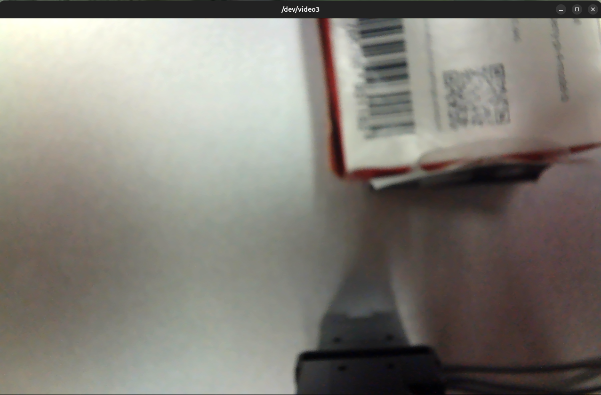

# 트러블슈팅

Stage 1(브링업/텔레옵)과 Stage 2(MoveIt2 pick-and-place) 진행 중 실제로 겪은 에러와 해결법입니다. 증상으로 `Ctrl+F` 검색해서 찾아보세요.

## Stage 1 — 환경 세팅 / 브링업

| 증상 | 원인 | 해결 |
| --- | --- | --- |
| OpenCR 업로드 시 `arm-none-eabi-g++: no such file or directory` | Ubuntu 24.04(Noble)에서 매뉴얼의 `libncurses5-dev:i386` 패키지 미제공. 파일은 있는데 32비트 동적 링커가 없음 | `sudo dpkg --add-architecture i386` 후 `libc6:i386 libncurses6:i386 libstdc++6:i386` 설치 |
| Arduino IDE 첫 실행 시 `FATAL: setuid_sandbox_host.cc(158)] The SUID sandbox helper binary was found, but is not configured correctly` | Arduino IDE 2.x AppImage의 샌드박스 설정 문제 | `./arduino-ide --no-sandbox` 옵션으로 실행 (alias 등록 권장) |
| ROS2 통신 시 `[TxRxResult] There is no status packet!` | OpenCR에 `usb_to_dxl` 펌웨어가 업로드되지 않은 상태 | Arduino IDE에서 `File → Examples → OpenCR → 10.Etc → usb_to_dxl` 업로드 |
| 브링업 시 `Error opening serial port!` 반복 | `open_manipulator_x.launch.py`의 `port_name` 기본값이 U2D2용(`/dev/ttyUSB0`). OpenCR은 `/dev/ttyACM0` | 브링업 명령에 `port_name:=/dev/ttyACM0` 명시 |
| `rosdep install`이 로컬 소스 패키지를 인식 못 함 | 클론한 패키지(DynamixelSDK 등)가 rosdep DB에 없음 | `--skip-keys="librealsense2 dynamixel_hardware_interface dynamixel_interfaces dynamixel_sdk open_manipulator robotis_interfaces"` 추가 |
| OpenCR 업로드 실패 | 보드가 정상 응답 안 함 | Recovery Mode 진입: 전원 ON → `PUSH SW2` 누른 채 `Reset` 눌렀다 떼기 → `PUSH SW2` 떼기. STATUS LED 100ms 간격 점멸 확인 |

## Stage 1 부가 — Ubuntu 계정 표준화 시 (랩 공용 세팅)

| 증상 | 원인 | 해결 |
| --- | --- | --- |
| GDM 로그인 화면에 옛날 이름이 뜸 | GDM은 로그인명이 아니라 GECOS(Full Name) 필드를 표시 | `sudo usermod -c "새이름" $USER` |
| 계정 rename 후 Chrome이 인터넷 연결 불가처럼 나옴 | Chrome Singleton lock 파일이 옛 호스트명을 참조 | `~/.config/google-chrome/Singleton*` 삭제 |
| 계정 rename 후 ROS2 빌드 에러 | 빌드 아티팩트에 절대경로가 하드코딩되어 있음 | `rm -rf build install log && colcon build` |

## Stage 2 — MoveIt2 Pick-and-Place (`moveit_py`)

실제로 겪은 순서대로 정리했습니다.

| # | 증상 | 원인 | 해결 |
| --- | --- | --- | --- |
| 1 | `RuntimeError: Failed to load planning pipelines from parameter server` | `MoveItConfigsBuilder`가 만드는 `planning_pipelines`는 move_group용 평평한 리스트(`['ompl', ...]`)인데, `moveit_py`의 `MoveItCpp`는 같은 파라미터를 `{'pipeline_names': [...]}` 중첩 구조로 기대함 | 스크립트 안에서 `moveit_config['planning_pipelines'] = {'pipeline_names': [...]}`로 재구성 (yaml 파일은 안 건드림) |
| 2 | `No planning pipeline available for name ''` | `PlanRequestParameters`가 `<group>.plan_request_params.*` 네임스페이스에서 기본값(플래너·파이프라인 이름)을 읽으려는데 config에 없어서 전부 빈 값 | `plan_params.planning_pipeline='ompl'`, `planner_id='RRTConnect'` 등 코드에서 직접 지정 |
| 3 | `Segmentation fault` (스크립트 종료 시) | `moveit_py.shutdown()`(C++ 소멸자)의 알려진 업스트림 버그. 실물 팔 동작과는 무관 — plan 실패를 정확히 감지하고 안전하게 멈춘 뒤 발생 | 정상 종료 로직 대신 `os._exit()`로 프로세스 강제 종료 |
| 4 | `Action client not connected to action server: arm_controller/follow_joint_trajectory` | bringup(컨트롤러 매니저)이 안 떠 있거나 컨트롤러가 아직 active 아님 | bringup 켜진 상태 확인 후 재실행 |
| 5 | `Unable to sample any valid states for goal tree` (IK 실패) | 좌표가 실제로 도달 불가능한 위치(placeholder 예시값)였음 | RViz Plan으로 먼저 도달 가능 여부 확인 후 좌표 결정, 또는 수동교시로 실측 |
| 6 | 수동교시로 실측한 좌표인데도 같은 IK 실패 | `arm` 그룹은 position-only IK(3값 목표에 4관절 → 여유자유도 1개)라 같은 XYZ에 도달하는 관절 조합이 여러 개 존재. OMPL의 랜덤 IK 샘플링이 손으로 배치했던 충돌 없는 조합이 아니라 **자기충돌하는 다른 조합**으로 계속 수렴 | 좌표(Cartesian) 목표 대신 **관절값(joint-space) 목표**로 전환 — `RobotState.set_joint_group_positions()`로 검증된 관절값을 직접 지정, IK 재탐색 생략 |
| 7 | `Invalid Trajectory: start point deviates from current robot state more than 0.01` | 직전 스텝 실행 직후 planning scene monitor의 상태 캐시가 실제 로봇 상태를 아직 못 따라와서, 다음 planning이 오래된 상태를 기준으로 계산됨 | 매 스텝 실행 후 `time.sleep(0.5)`로 상태 안정 시간 확보 |
| 8 | 그리퍼가 안 움직이는 것처럼 보임 (오탐) | 그리퍼가 이미 close 상태에서 다시 close 명령 → 물리적 변화 없어서 안 움직인 것처럼 보였을 뿐 | `moveit_py`를 완전히 배제하고 컨트롤러 직접 테스트로 정상 동작 확인 (아래 진단 명령 참고) |

### Stage 2 진단에 쓴 명령어 모음

```bash
# 컨트롤러 상태 확인
ros2 control list_controllers

# 그리퍼 액션 서버 확인
ros2 action list | grep gripper

# moveit_py/스크립트를 완전히 배제하고 컨트롤러 직접 테스트
ros2 action send_goal /gripper_controller/gripper_cmd control_msgs/action/GripperCommand \
  "{command: {position: -0.01, max_effort: 0.0}}"

# 관절 상태 실시간 확인
ros2 topic echo /joint_states
```

## Stage 2 — 하드웨어 이슈

### 그리퍼 open/close 방향 반전

**증상**: GUI/MoveIt/teleop 등 그리퍼를 제어하는 모든 경로에서 `open` 명령 시 실제로는 닫히고, `close` 명령 시 열림.

**진단**: GUI(`main_window.cpp`), MoveIt SRDF(`open_manipulator_x.srdf`), URDF(`open_manipulator_x_arm.urdf.xacro`) 세 곳 모두 "양수 값 = open"으로 일치 — 소프트웨어 쪽 의미 정의는 문제 없음. 근본 원인은 **조립 시 그리퍼 구동 모터가 설계 기준과 반대 방향으로 장착**된 것.

**조치**: `dynamixel_hardware_interface`에서 raw encoder 값을 미터 단위로 변환하는 최하단 레이어 수정. 파일: `src/open_manipulator/open_manipulator_description/ros2_control/open_manipulator_x_position.ros2_control.xacro` (dxl5 / 그리퍼, ID 15) — `[unit info]`의 multiplier·offset 부호를 전부 반전.

```diff
- Present Position,0.000017626621790,m,signed,-0.036099321;
- Goal Position,0.000017626621790,m,signed,-0.036099321;
- Present Velocity,0.000275558153557,rad/s,signed,0.0;
- Goal Velocity,0.000275558153557,rad/s,signed,0.0;
+ Present Position,-0.000017626621790,m,signed,0.036099321;
+ Goal Position,-0.000017626621790,m,signed,0.036099321;
+ Present Velocity,-0.000275558153557,rad/s,signed,0.0;
+ Goal Velocity,-0.000275558153557,rad/s,signed,0.0;
```

`값 = raw × multiplier + offset` 변환식에서 multiplier·offset을 동시에 음수로 뒤집으면 물리적 가동범위는 유지한 채 "이 값이 open이냐 close냐"라는 라벨만 교정됩니다. 다이나믹셀 펌웨어 레벨의 `Drive Mode`(reverse bit)는 원점(zero) 보정과 얽혀 재-homing이 필요할 위험이 있어 건드리지 않고, ROS 드라이버 쪽 소프트웨어 변환식만 수정했습니다. GUI/MoveIt SRDF의 `open=0.019`, `close=-0.01` 값은 수정 없이 그대로 사용 가능합니다.

**검증**: 새 로봇(아래 이슈로 교체된 개체)에서 GUI open/close 버튼 정상 동작 확인 완료.

### 브링업 중 통신 끊김 / 발열 (배선 이슈, 코드와 무관)

**증상**: 팔이 움직이기 시작하면 `FastSyncRead Rx Fail COMM_RX_TIMEOUT(-3001)`이 5축 전체에서 반복 발생, 컨트롤러 강제 비활성화. 기체 발열 동반.

**원인**: 1축(joint1) 근처 전선이 관절에 여러 번 감겨 끼어 있었고, 반복 구동 중 피복이 벗겨지며 부하 발생 → 통신 불안정 + 발열.

**조치**: 로봇 교체로 해결. (5축 전체가 동시에 응답 끊기는 패턴이라 그리퍼 unit info 값과는 다른 레이어의 문제였음 — 코드 수정과 무관)

## Stage 3 — ArUco 마커 인식 (`ros2-aruco-pose-estimation`)

`AIRLab-POLIMI/ros2-aruco-pose-estimation`은 Humble/Iron 공식 지원이라 Jazzy에서 그대로 쓰면 막히는 지점이 여러 곳 있었습니다. 실제로 겪은 순서대로 정리했습니다.

| # | 증상 | 원인 | 해결 |
| --- | --- | --- | --- |
| 1 | `rosdep install` 시 `Cannot locate rosdep definition for [tf2_transformations]` | 업스트림 `aruco_pose_estimation/package.xml`에 `tf2_transformations`로 오타(실제 import는 `tf_transformations`, rosdep 키도 `tf_transformations`만 존재) | `rosdep install --skip-keys "tf2_transformations"` 후 `sudo apt install ros-jazzy-tf-transformations` 별도 설치 |
| 2 | `rosdep install` 시 `Cannot locate rosdep definition for [open3d]` | `package.xml`에 `open3d` 의존성이 선언돼 있으나 실제 코드(`aruco_node.py`, `pose_estimation.py`, `utils.py`) 어디서도 import 안 함, `CMakeLists.txt`의 `find_package(open3d)`도 주석 처리됨 — RGB-only 사용 시 불필요 | `rosdep install --skip-keys "open3d"`로 무시 (설치 자체가 불필요) |
| 3 | `aruco_node.py` 실행 시 `AttributeError: module 'cv2.aruco' has no attribute 'ArucoDetector'` | 코드가 OpenCV 4.7.0+의 `cv2.aruco.ArucoDetector` API를 쓰는데, apt `python3-opencv`는 4.6.0 | `pip3 install opencv-contrib-python==4.10.0.84 --break-system-packages`로 신버전 설치 (site-packages 우선순위상 apt판을 가림) |
| 4 | 위 pip 설치 직후 `scipy`가 `UserWarning: A NumPy version >=1.21.6 and <1.28.0 is required` | `opencv-contrib-python` 최신판(5.x)이 의존성으로 `numpy>=2`를 강제 설치하면서 시스템 numpy(1.26.4, apt)를 사용자 site-packages의 2.5.1로 덮어씀 — `moveit_py` 등 numpy C-API를 쓰는 다른 노드까지 깨질 수 있는 위험한 상태였음 | `pip3 install "numpy<2" "opencv-contrib-python==4.10.0.84" --break-system-packages`로 버전 고정 (4.10.0.84는 ArucoDetector 있으면서 numpy 1.x와도 호환) |
| 5 | `camera_calibration` GUI 실행 시 `cv2.error: ... Rebuild the library with Windows, GTK+ 2.x or Cocoa support` | `opencv-contrib-python-headless`(GUI 기능 없는 빌드)를 설치했었음 — `aruco_node.py`는 GUI가 필요 없어 문제없었지만 `cameracalibrator`의 `cv2.namedWindow`에서 크래시 | headless를 지우고 GUI 포함판 `opencv-contrib-python`(같은 4.10.0.84)으로 교체 |
| 6 | 패키지 동봉 `aruco_pose_estimation.launch.py`를 그대로 실행하면 `realsense2_camera` 관련 에러로 launch 자체가 실패 | 이 launch 파일은 `use_depth_input` 값과 무관하게 RealSense 카메라(`realsense2_camera`의 `rs_launch.py`)를 항상 include하도록 작성돼 있음 — usb_cam 조합을 고려 안 함 | launch 파일을 쓰지 않고 `ros2 run aruco_pose_estimation aruco_node.py --ros-args -p ...`로 노드를 직접 실행, 필요한 파라미터만 CLI로 override |
| 7 | 위와 같이 직접 실행하면 카메라 정보가 계속 안 들어와서(`No camera info has been received!`) `/aruco_poses`가 영원히 안 나옴 | `camera_info_topic` 기본값이 `/camera/color/camera_info`(RealSense용)인데 usb_cam은 `/camera_info`로 발행 | `-p camera_info_topic:=/camera_info`로 명시적 override 필수 |
| 8 | 마커가 잡혀도 `numpy.linalg.LinAlgError: Matrix is not positive definite` (`tf_transformations.quaternion_from_matrix` 내부)로 노드 크래시 | usb_cam이 캘리브레이션 파일 없이 뜨면 `camera_info`의 K행렬이 전부 0으로 발행됨 — 이 상태로 `solvePnP` 결과가 유효한 회전행렬이 아니게 되어 쿼터니언 변환이 수학적으로 실패 | 체커보드 캘리브레이션으로 실제 K/D를 확보하기 전까지는 pose 발행이 원천적으로 불가능. 아래 캘리브레이션 항목 참고 |
| 9 | `ros2 run camera_calibration cameracalibrator ...` 실행 후 `Waiting for service camera/set_camera_info ...`에서 멈춤 | 도구가 기본으로 찾는 서비스명(`camera/set_camera_info`)이 usb_cam이 실제로 광고하는 서비스명(`/usb_cam/set_camera_info`)과 다름 | `-r camera/set_camera_info:=/usb_cam/set_camera_info` remap 추가 |
| 10 | 체커보드를 아무리 움직여도 게이지(X/Y/Size/Skew)가 하나도 안 참 | `--size`는 **내부 코너 개수** 기준인데 보드의 "사각형 칸 수"(9x7)를 그대로 넣었음 | 칸 수가 아니라 `(칸 수-1)`로 변환해서 `--size 8x6` 사용 |
| 11 | 마커까지 거리(z)가 실제와 정확히 2배 차이남 | `marker_size` 파라미터를 실측(0.058m) 대신 임시값(0.1m)으로 넣고 테스트함 — `solvePnP`는 지정한 마커 크기를 기준으로 거리를 역산하므로, 크기를 실제보다 N배로 잘못 알려주면 거리도 N배로 그대로 스케일됨 | `marker_size`를 실측값으로 정확히 맞춰야 함 (자로 잴 때 흰 여백 제외, 검은 패턴 사각형 한 변만) |
| 12 | `ros2 run aruco_pose_estimation generate_aruco_marker.py`가 `No executable found` | 마커 생성 스크립트가 업스트림에 없어서 새로 작성했는데, 실행 권한(`chmod +x`)을 빼먹으면 `install(PROGRAMS ...)`로 설치돼도 ament 실행파일 인덱스에 등록 안 됨 | `chmod +x scripts/generate_aruco_marker.py` 후 재빌드 |

**남은 정밀도 이슈 (미해결, MoveIt2 연동 전 개선 필요)**: 체커보드 캘리브레이션(8x6, 24mm) 후 실측 30cm/60cm 지점에 마커를 두고 `/aruco_poses`의 z값을 비교하면 각각 25.7cm(-14%), 48.3cm(-20%)로 **일관되게 짧게** 측정됨. 두 지점 모두 반복 측정 시 노이즈는 거의 없어(±1mm 이내) 정밀도(precision) 자체는 좋으나, 정확도(accuracy)에 스케일성 오차가 있음 — `marker_size` 측정 기준 재확인, 그리고 체커보드를 화면 전역(구석·다양한 각도)에 더 많이 채워서 캘리브레이션을 재실행해볼 것.

**참고**: C920을 usb_cam에 물릴 때 `/dev/video2`가 실제 캡처 노드였음 (`/dev/video3`는 메타데이터 전용이라 `cv2.VideoCapture`로 열리지 않는 게 정상). 1280x720/30Hz로 요청해도 실제 관측 프레임레이트는 ~7.5Hz 수준이었음 (MJPEG 디코딩 오버헤드로 추정, 원인 미조사).

## Stage 3 후속 — 자동 캘리브레이션 + ArUco Pick-and-Place (`calibrate_camera_to_base` / `pick_and_place_aruco`)

실제로 겪은 순서대로 정리했습니다.

| # | 증상 | 원인 | 해결 |
| --- | --- | --- | --- |
| 1 | `usb_cam_node_exe`가 포맷 목록 출력 직후 `terminate called after throwing an instance of 'char*'`로 크래시 | `pixel_format` 파라미터를 지정 안 하면 드라이버가 포맷 협상에 실패 | `-p pixel_format:=yuyv` 명시 |
| 2 | ArUco pose의 z값이 실제보다 크게 틀어짐 (marker_size는 이미 정확한데도) | `~/.ros/camera_info/default_cam.yaml` 캘리브레이션이 1280x720 기준인데 usb_cam 기본 해상도는 640x480 — 카메라 내부 파라미터와 실제 이미지 크기 불일치 | `-p image_width:=1280 -p image_height:=720`으로 캘리브레이션 파일과 맞춤 |
| 3 | `aruco_pose_estimation.launch.py` 실행 시 `realsense2_camera` 관련 예외로 launch 전체가 죽고, 안에서 막 뜬 `aruco_node.py`까지 같이 종료 | 이 launch 파일은 `use_depth_input` 값과 무관하게 RealSense 카메라를 항상 include하려 시도 (usb_cam 조합 미고려) | launch 파일 대신 `ros2 run aruco_pose_estimation aruco_node.py --ros-args -p ...`로 노드 직접 실행 |
| 4 | `ros2 topic echo /aruco/markers`(슬래시 표기)에 아무것도 안 뜨는데 `/aruco_image`(rqt)에는 초록 바운딩 박스가 뜸 | `aruco_node.py`의 `declare_parameter` 기본값은 `/aruco_markers`(언더스코어)인데, `aruco_parameters.yaml`은 `/aruco/markers`(슬래시)로 재정의함 — launch 파일 없이 노드를 직접 실행하면 yaml이 아예 안 읽혀서 코드 기본값(언더스코어)이 그대로 적용됨 | 실제 발행 토픽인 `/aruco_markers`, `/aruco_image`, `/aruco_poses`(전부 언더스코어)로 구독 |
| 5 | 그리퍼에 마커를 붙였는데 카메라에 보이는데도 `/aruco_markers`에 안 찍힘 | 마커 배경(그리퍼)이 검정이라 마커 자체 테두리(검정)와 배경이 합쳐져서 사각형 윤곽 검출 실패 — ArUco 인식은 검정 테두리 바깥의 흰색 여백(quiet zone)과의 대비가 필수 | `generate_aruco_marker.py --margin <px>` 옵션(기본 `--size`의 25%)으로 흰 여백을 두른 마커 재생성 |
| 6 | `tf2_ros.Buffer.transform()`에서 `"world" passed to lookupTransform argument target_frame does not exist` — 캘리브레이션 노드가 분명히 살아있는데도 실패 | `Buffer.can_transform()`/`transform()`은 `timeout` 동안 `sleep(0.02)`로 busy-wait만 하고 노드를 spin하지 않는 알려진 제약(ros2/geometry2 #327) — TF가 아직 안 왔으면 timeout을 아무리 늘려도 절대 못 받음 | `can_transform()`이 참이 될 때까지 `rclpy.spin_once()`를 직접 반복 호출한 뒤에 `transform()` 호출 |
| 7 | 캘리브레이션을 몇 번을 다시 돌려도 계산된 물체 좌표의 z가 재현 가능하게(랜덤이 아니게) 도달 불가능한 범위로 나옴 | ID 0 마커가 `end_effector_link` 원점이 아니라 그리퍼 표면(실측 약 8cm, EE 로컬 -x 방향)에 붙어 있어서, 웨이포인트마다 그리퍼가 회전하면 이 물리적 오프셋도 같이 회전 → TCP=마커라는 강체 변환 가정이 깨짐 | FK의 orientation까지 읽어서 `TCP위치 + R(TCP방향) @ 오프셋벡터`로 마커의 실제 world 좌표를 역산한 뒤 Kabsch에 사용 (`MARKER_OFFSET_IN_EE_FRAME`) |
| 8 | `moveit_x_moveit.launch.py`(RViz+`move_group`)를 켜둔 채로 `moveit_py` 스크립트(캘리브레이션/pick-and-place, **Stage 2 원본 `pick_and_place.py`로도 재현됨**)를 실행하면 어떤 좌표를 목표로 잡든 `Unable to sample any valid states for goal tree`로 항상 실패 | `moveit_py`는 `move_group`에 붙는 클라이언트가 아니라 독립된 두 번째 planning 파이프라인을 내장함 — 두 개의 planning scene 추적기가 동시에 떠서 충돌 | `moveit_py` 스크립트를 돌릴 땐 moveit launch를 켜지 말고 브링업만 켜둘 것 |
| 9 | Stage2 검증 좌표와 1cm 이내로 가까운 좌표인데도 pre-grasp가 계속 `Unable to sample any valid states for goal tree`로 실패 (moveit launch를 꺼도 재현) | `arm`은 position-only IK라 여유자유도 1개 — OMPL이 pose 목표에 대해 자체적으로 고르는 IK 시드가 자꾸 자기충돌 해로 수렴함 (Stage2가 pre-place/place에서 이미 겪어서 관절값 목표로 우회했던 것과 동일 증상, 카메라 좌표는 미리 손교시할 수 없어 그 우회가 불가능했음) | `RobotState.set_from_ik()`를 home 자세 시드로 직접 호출해 관절값을 구한 뒤 `move_arm_to_joint_positions()`로 실행 (OMPL의 자체 IK 샘플링 우회) — `move_arm_to_pose_seeded()` |
| 10 | 위 수정 후에도 이따금 IK 실패 | `kinematics_solver_timeout` 50ms가 경계 자세 근처에서 여유 부족 | 100ms로 상향 (`pick_and_place.py`의 `build_moveit_py()`, 세 스크립트 공용) |
| 11 | 계산된 좌표로 이동은 잘 되는데 그리퍼가 물체를 살짝 빗나가서(수 cm) 잘 못 집음 | depth 카메라 없이 단안(monocular) `solvePnP`만으로 위치 추정 — 마커 부착 위치와 실제 그립 지점 사이 물체별 오차가 항상 존재 | `GRASP_X_OFFSET`/`GRASP_Y_OFFSET`/`GRASP_Z_OFFSET`(`pick_and_place_aruco.py`)을 실물 테스트로 경험적으로 튜닝 |

### 카메라 마운트 위치: eye-in-hand(그리퍼 장착) 시도 → 오버헤드 고정으로 회귀

**시도**: 세션마다 카메라-베이스 캘리브레이션을 새로 돌려야 하는 부담을 줄이려고, 아두캠(OV9782)을 그리퍼 근처에 직접 마운트해서 TCP 기준 고정 오프셋 한 번만 구하면 되는 eye-in-hand 구성을 검토.

**증상**: 그리퍼에 카메라를 달고 아래를 보게 했을 때, 초기 포즈 기준 카메라가 지면과 약 20cm밖에 안 떨어져 있어서 화각 안에 들어오는 바닥 영역이 물체보다 작음 — 물체가 시야 중심에서 조금만 벗어나도 프레임 밖으로 나가 버림.



**원인**: OpenManipulator-X는 리치가 짧은 소형 팔이라 작업 포즈에서 엔드이펙터가 바닥과 가까움. 카메라 화각(FOV)이 실제로 커버하는 면적은 대상과의 거리에 비례해서 줄어들기 때문에, 이 거리에서는 인식에 필요한 관측 영역을 확보할 수 없음.

**결론**: 아두캠 eye-in-hand 시도는 폐기하고, 로지텍 C920을 위에서 내려다보는 고정 오버헤드 구성으로 회귀 (기존 Stage 3 방식 유지). eye-in-hand 방식 자체는 유효한 접근(TCP-카메라 오프셋을 hand-eye calibration으로 한 번만 구하면 이후 세션별 재캘리브레이션이 불필요해짐 — 다른 프로젝트의 M0609+RealSense 구성에서 확인된 패턴)이지만, **팔의 작업 반경·높이가 충분히 커야 성립하는 전제 조건**이 있음. 소형 팔에서는 오버헤드 고정 카메라 쪽이 더 실용적인 선택.

**참고 (우리 코드 문제 아님)**: 이 워크스테이션은 다른 랩 프로젝트(Doosan 로봇 `dsr01` 네임스페이스, 스테레오 카메라 캘리브레이션 리그)와 기본 `ROS_DOMAIN_ID`를 공유하고 있어서, `ros2 node list`/`ros2 topic list`에 무관한 노드·토픽이 섞여 나옵니다. 디버깅 중 낯선 노드가 보이면 이것부터 의심할 것 — 특히 카메라 장치(`/dev/videoN`) 파라미터가 겹치면 실제 충돌도 납니다 (`ros2 topic info <topic> -v`로 퍼블리셔 노드 확인).

## 일반 참고

- `emanual.robotis.com` 문서는 일부 outdated 되어 있으므로 실제 패키지 소스 및 실험으로 교차 검증이 필요합니다.
- 반나절 넘게 혼자 막히면 에러 메시지를 통째로 복사해서 바로 질문하세요.
